# Oops, Later! — Full Project Study Guide

> This guide is designed for a student who does not know syntax but wants to understand, explain, and safely edit the full project.
>
> It is written from the actual code in the current workspace and uses a visual-first style wherever possible.

---

# Phase 1 — Document Setup + Project Overview

## 1. Title Page

### Project Name

**Oops, Later!**

### Tagline

**Procrastinate with style**

### Tech Stack

| Layer | Technology | What it does |
|---|---|---|
| Structure | HTML | Builds the page skeleton |
| Styling | CSS | Controls colors, layout, spacing, dark mode, and responsiveness |
| Frontend logic | JavaScript | Handles task creation, rendering, storage, search, reminders, and UI behavior |
| Backend / file serving | Python + Flask | Serves the app files to the browser |
| Production-friendly serving | Waitress | Runs the Python app on Windows or when explicitly enabled |
| Storage | Browser `localStorage` | Saves tasks and theme locally in the browser |

### Purpose of This Document

This study guide is meant to help a complete beginner understand the full "Oops, Later!" codebase from scratch. The goal is not just to read the project, but to become **edit-ready**: able to explain what each file does, follow how data moves through the app, and make safe changes without guessing.

### Who This Guide Is For

- someone who does not know syntax yet
- someone preparing for a viva, demo, handoff, or self-study
- someone who wants to move from "I can read this project a little" to "I can safely edit this project"

---

## 2. Table of Contents

This guide will be built across all planned phases.

1. [Document Setup + Project Overview](#phase-1--document-setup--project-overview)
2. [Universal Coding Basics Before Reading the Project](#phase-2--universal-coding-basics-before-reading-the-project)
3. [Python Syntax Explained Using This Project](#phase-3--python-syntax-explained-using-this-project)
4. [JavaScript Syntax Basics Before Reading the JS Files](#phase-4--javascript-syntax-basics-before-reading-the-js-files)
5. [`storage.js` — Data Persistence and Export Layer](#phase-5--storagejs--data-persistence-and-export-layer)
6. [`taskParser.js` — Natural Language Parsing Explained](#phase-6--taskparserjs--natural-language-parsing-explained)
7. [`app.js` — The Main Application Brain](#phase-7--appjs--the-main-application-brain)
8. [`sampleData.js` — Demo Records and Data Shape](#phase-8--sampledatajs--demo-records-and-data-shape)
9. [`index.html` — The UI Skeleton](#phase-9--indexhtml--the-ui-skeleton)
10. [`styles.css` — Visual Design, Dark Mode, Responsiveness](#phase-10--stylescss--visual-design-dark-mode-responsiveness)
11. [Supporting Files and Project Configuration](#phase-11--supporting-files-and-project-configuration)
12. [How All Files Work Together](#phase-12--how-all-files-work-together)
13. [Universal Syntax Master Reference for This Entire Project](#phase-13--universal-syntax-master-reference-for-this-entire-project)
14. [Edit-Ready and Viva-Ready Cheat Sheet](#phase-14--edit-ready-and-viva-ready-cheat-sheet)
15. [Final Polish / Document Merge](#phase-15--final-polish--document-merge)

---

## 3. Project Overview

### What This App Does

Oops, Later! is a web-based productivity and task management app. It helps a user create tasks, organize them, assign dates and times, add tags, track status, and move tasks through different states like:

- To Do
- Doing
- Done

It also includes extra features like:

- quick task entry using natural language
- Today and Upcoming views
- trash and restore behavior
- analytics
- browser reminders
- sample/demo tasks
- energy-based task suggestions

### Who It Is Useful For

This app is useful for:

- students managing assignments and deadlines
- professionals tracking work tasks
- people who want a visual to-do board
- users who want a local app without accounts or logins

### Main Features

| Feature | What it means in simple English |
|---|---|
| Quick Add | Type a task quickly into one input bar |
| Natural Language Parsing | The app tries to understand words like `tomorrow`, `3pm`, or `#work` |
| Board View | Tasks appear in columns like a Kanban board |
| Today / Upcoming Views | Tasks can be grouped by date relevance |
| Tags and Priority | Tasks can be labeled and ranked |
| Trash | Deleted tasks can be restored later |
| Theme Toggle | The page can switch into dark mode |
| Notifications | The browser can remind the user about due tasks |
| Sample Tasks | New users can load demo data and explore the app immediately |

### Why This Project Is Lightweight

This project is lightweight because it does **not** use:

- a database server
- user accounts
- cloud sync
- a large backend API

Instead, it stores most of its data in the browser itself. That keeps the project simple to run and easy to study.

### Why the Frontend Is Large and the Backend Is Small

In this project, most of the behavior happens in the browser. That means the JavaScript side is much larger than the Python side.

| Part | Why it is small or large |
|---|---|
| Backend (`server.py`) | Small because it mainly serves files |
| Frontend (`app.js`, `storage.js`, `taskParser.js`) | Large because it handles task logic, rendering, parsing, reminders, and UI changes |

### Why `localStorage` Is Used

The app uses browser `localStorage` so tasks can stay on the same device and browser without needing a database.

That means:

- easy setup
- no login required
- works as a local app

But it also means:

- data stays only in that browser
- another browser or device will not automatically have the same tasks
- clearing browser data can remove saved tasks

---

## 4. Folder Structure Overview

### Project Folders

| Path | Role |
|---|---|
| root folder | Holds the main entry files and configuration files |
| `css/` | Holds the stylesheet for the app |
| `js/` | Holds all frontend JavaScript logic |

### Root Folder Files

| File | Role |
|---|---|
| `index.html` | Main HTML page shown in the browser |
| `server.py` | Flask server that serves the app files |
| `main.py` | Small Python file that imports the app from `server.py` |
| `README.md` | Human-readable project description |
| `requirements.txt` | Python dependency list |
| `pyproject.toml` | Modern Python project metadata and dependency file |

### `css/` Folder

| File | Role |
|---|---|
| `css/styles.css` | Controls the visual appearance of the app |

### `js/` Folder

| File | Role |
|---|---|
| `js/app.js` | Main frontend controller |
| `js/storage.js` | Saving, loading, and exporting data |
| `js/taskParser.js` | Natural language parser for typed task text |
| `js/sampleData.js` | Demo tasks for first-time users |

### Supporting Files

| File | Why it matters |
|---|---|
| `README.md` | Helps humans understand the project quickly |
| `requirements.txt` | Helps Python install needed packages |
| `pyproject.toml` | Stores project dependency and configuration details |

---

## 5. Full Project Startup Flow

### Important Accuracy Note

The requested startup story says:

1. user runs `python main.py`
2. Flask starts
3. `server.py` serves `index.html`
4. browser loads `styles.css` and JS files
5. `app.js` initializes the app
6. `storage.js` loads saved tasks
7. `taskParser.js` waits for input parsing
8. UI renders

That is a useful learning sequence, but the **current repo truth** is slightly different:

- `main.py` only imports `app` from `server.py`
- the actual runnable server file is `server.py`
- the browser is opened manually

So this guide will show:

- the requested learning flow
- and the actual behavior of the current workspace

### Step-by-Step Startup Flow

#### Step 1: User runs Python

Requested learning flow:

```bash
python main.py
```

Actual current repo behavior:

- `main.py` imports `app` from `server.py`
- that alone does **not** fully start the server in the current code

Actual runnable command in this repo:

```bash
python server.py
```

#### Step 2: Flask App Is Created

Inside `server.py`, Flask creates the app object:

- Flask is imported
- routes are defined
- the server chooses a port
- the app begins listening for browser requests

#### Step 3: `server.py` Serves `index.html`

When the browser asks for `/`, Flask sends:

```text
index.html
```

That file becomes the main page structure for the app.

#### Step 4: Browser Loads `styles.css` and JS Files

At the bottom of `index.html`, the browser loads:

1. `js/storage.js`
2. `js/taskParser.js`
3. `js/sampleData.js`
4. `js/app.js`

And in the `<head>`, it loads:

- `css/styles.css`

#### Step 5: `app.js` Initializes the App

When the HTML page is ready, JavaScript runs:

```javascript
document.addEventListener('DOMContentLoaded', init);
```

Then `init()` begins the frontend startup process.

#### Step 6: `storage.js` Loads Saved Tasks

`app.js` calls:

```javascript
Storage.getTasks()
```

This reads saved tasks from browser `localStorage`.

#### Step 7: `taskParser.js` Waits for Input Parsing

`taskParser.js` does not create tasks by itself at startup. Instead, it becomes available so later, when the user types something like:

```text
Submit assignment tomorrow #college high priority
```

the app can parse that text into structured task data.

#### Step 8: UI Renders

Finally, `app.js` draws the visible interface:

- the active view
- task cards
- sidebar state
- focus area
- welcome popup if needed

At that point, the app becomes fully interactive.

---

## 6. Mermaid Flowchart

```mermaid
flowchart TD
    A["User runs Python command"]:::input --> B{"Which file is run?"}:::decision
    B -->|Requested learning flow| C["`python main.py`"]:::python
    B -->|Actual repo start| D["`python server.py`"]:::python

    C --> E["`main.py` imports `app` from `server.py`"]:::python
    E --> F["Flask app object is created"]:::server
    F --> G["Current repo note: `main.py` alone does not fully start the server"]:::warning

    D --> H["`server.py` starts the Flask/Waitress server"]:::server
    H --> I["Browser requests `/`"]:::browser
    I --> J["Flask serves `index.html`"]:::server
    J --> K["Browser loads `css/styles.css`"]:::asset
    J --> L["Browser loads `js/storage.js`"]:::asset
    J --> M["Browser loads `js/taskParser.js`"]:::asset
    J --> N["Browser loads `js/sampleData.js`"]:::asset
    J --> O["Browser loads `js/app.js`"]:::asset
    O --> P["`DOMContentLoaded` runs `init()`"]:::js
    P --> Q["`storage.js` loads saved tasks"]:::js
    P --> R["`taskParser.js` becomes ready for future typed input"]:::js
    P --> S["UI is rendered on screen"]:::ui

    classDef input fill:#fef3c7,stroke:#d97706,color:#451a03,stroke-width:2px;
    classDef decision fill:#e0f2fe,stroke:#0284c7,color:#082f49,stroke-width:2px;
    classDef python fill:#dbeafe,stroke:#1d4ed8,color:#0f172a,stroke-width:2px;
    classDef server fill:#dcfce7,stroke:#15803d,color:#052e16,stroke-width:2px;
    classDef browser fill:#fce7f3,stroke:#db2777,color:#500724,stroke-width:2px;
    classDef asset fill:#fae8ff,stroke:#a21caf,color:#3b0764,stroke-width:2px;
    classDef js fill:#ffe4e6,stroke:#e11d48,color:#4c0519,stroke-width:2px;
    classDef ui fill:#ede9fe,stroke:#7c3aed,color:#2e1065,stroke-width:2px;
    classDef warning fill:#fee2e2,stroke:#dc2626,color:#450a0a,stroke-width:2px;
```

---

## 7. Markmap-Style Hierarchy

This nested bullet structure is written so it can later be converted into a Markmap-style diagram.

- Oops, Later!
  - Root folder
    - `index.html`
      - UI skeleton
      - loads CSS
      - loads JavaScript files
    - `server.py`
      - creates Flask app
      - serves files to browser
    - `main.py`
      - imports Flask app from `server.py`
    - `README.md`
      - project explanation
    - `requirements.txt`
      - Python packages
    - `pyproject.toml`
      - project metadata and dependencies
  - `css/`
    - `styles.css`
      - colors
      - layout
      - dark mode
      - responsiveness
  - `js/`
    - `app.js`
      - main frontend controller
      - startup logic
      - render logic
      - task actions
    - `storage.js`
      - save tasks
      - load tasks
      - save theme
      - export data
    - `taskParser.js`
      - parse natural typed text
      - detect tags
      - detect dates
      - detect priority
    - `sampleData.js`
      - demo tasks
  - Runtime flow
    - user starts Python
      - requested learning flow
        - `python main.py`
      - actual repo start
        - `python server.py`
    - Flask server runs
    - browser requests page
    - `index.html` loads
    - browser loads `styles.css`
    - browser loads JS files
    - `app.js` starts
      - loads tasks from `storage.js`
      - waits to parse input through `taskParser.js`
      - can load demo tasks from `sampleData.js`
    - UI renders

---

# Phase 2 — Universal Coding Basics Before Reading the Project

## 1. What Is Code?

Code is a set of written instructions for a computer.

You can think of code like:

- a recipe for a machine
- a list of steps
- a set of rules that tells the computer what to do

In this project, the code tells the computer how to:

- show the task app page
- react when the user clicks buttons
- save tasks in the browser
- parse typed text like `tomorrow` or `#work`

### Important Basic Words

| Word | Simple meaning |
|---|---|
| source code | the text humans write in files |
| file | one code document, like `app.js` or `server.py` |
| instruction | one command the computer can follow |
| logic | the decision-making part of code |
| function | a named block of work |
| variable | a named place to store a value |
| input | what goes into code |
| output | what comes out of code |

### Example from This Project

```javascript
var tasks = [];
```

This means:

- `var` creates a variable
- `tasks` is the variable name
- `=` stores a value
- `[]` means an empty list

So the code is saying:

"Make a variable called `tasks`, and start it as an empty list."

## 2. Universal Ideas Across Languages

These ideas appear in almost every programming language.

### Variable

A variable is a named storage place.

Example:

```javascript
var theme = 'dark';
```

Meaning:

- the name is `theme`
- the stored value is `dark`

### Value

A value is the actual thing being stored.

Examples of values:

- text
- number
- true/false
- list
- object

### String

A string is text.

Example:

```javascript
'Task Added'
```

### Number

A number is numeric data.

Example:

```javascript
5000
```

### Boolean

A boolean means only one of two things:

- `true`
- `false`

Example:

```javascript
task.completed === true
```

### Array / List

An array is a list of values.

Example:

```javascript
['work', 'urgent']
```

### Object / Dictionary

An object stores named values.

Example:

```javascript
{
    title: 'Buy groceries',
    priority: 'medium'
}
```

### Function

A function is a named block of code that does one job.

Example:

```javascript
function loadTasks() {
    tasks = Storage.getTasks();
}
```

### Condition

A condition checks whether something is true or false.

Example:

```javascript
if (!value) {
    return;
}
```

This means:

- if `value` is empty or false-like
- stop here

### Loop

A loop repeats work.

Example:

```javascript
samples.forEach(function(taskData) {
    addTask(taskData);
});
```

This means:

- go through each sample task
- add each one

### Event

An event is something that happens, such as:

- a click
- a key press
- page load

Example:

```javascript
document.addEventListener('DOMContentLoaded', init);
```

### Return Value

A return value is what a function gives back.

Example:

```python
return response
```

### Parameter vs Argument

| Term | Meaning |
|---|---|
| parameter | the variable name inside the function definition |
| argument | the real value given when the function is called |

Example:

```javascript
function deleteTask(id) { ... }
deleteTask('task-123');
```

- parameter = `id`
- argument = `'task-123'`

### File / Module

A file stores code. A module is a file or package that other code can use.

Examples in this project:

- `storage.js`
- `taskParser.js`
- `server.py`

### Import

Import means bring code from another place into the current file.

Example:

```python
from flask import Flask, send_file
```

### Library / Framework

| Term | Meaning |
|---|---|
| library | reusable code someone else wrote |
| framework | a bigger structured system that helps build apps |

Examples here:

- Flask = framework/library used by Python server
- browser DOM APIs = built-in browser tools

## 3. Universal Symbol Reference

| Symbol/Pattern | Meaning in simple English | Seen in which language(s) | Example |
|---|---|---|---|
| `=` | store a value | JavaScript, Python | `var tasks = [];` |
| `==` | compare values loosely | JavaScript | Not used much here; this repo mostly uses `===` |
| `===` | compare values strictly | JavaScript | `theme === 'dark'` |
| `!=` | not equal loosely | JavaScript | Not used in current repo examples |
| `!` | not / opposite | JavaScript | `if (!value)` |
| `&&` | and | JavaScript | `meridiem === 'pm' && hours < 12` |
| `||` | or | JavaScript | `taskData.priority || 'medium'` |
| `{}` | object or code block | JavaScript, Python, CSS | `var task = { title: 'A' };` |
| `[]` | array or indexed item | JavaScript | `tags = [];` |
| `()` | function call or input holder | JavaScript, Python | `Storage.getTasks()` |
| `:` | connect name to value, or start a block | JavaScript, Python, CSS | `title: parsed.title` |
| `;` | end a statement | JavaScript, CSS | `saveTasks();` |
| `.` | access something inside something else | JavaScript, Python, CSS selector | `Storage.getTasks()` |
| `,` | separator | JavaScript, Python, CSS values | `Flask, send_file` |
| quotes `' '` or `" "` | mark text | JavaScript, Python, HTML | `'dark'` |
| `#` | comment in Python, ID in CSS/HTML, part of tag text in app input | Python, CSS/HTML, app text | `#sidebar` |
| `@` | decorator or special CSS rule | Python, CSS | `@app.route('/')` |
| `/pattern/` | regex pattern | JavaScript | `/\btomorrow\b/i` |
| `=>` | arrow function | JavaScript | Not used in this repo; this project uses `function(...)` style |

## 4. How to Read Code Line by Line

Use this method every time:

### Step 1: Identify the File

Ask:

- what file am I reading?
- is it Python, JS, HTML, or CSS?
- what role does this file play?

### Step 2: Identify the Block

Look for:

- function block
- object block
- HTML section
- CSS rule

### Step 3: Identify Variable Names

Ask:

- what names are storing values?
- what do those names probably represent?

### Step 4: Identify Function Names

Ask:

- what is the function called?
- what job is it trying to do?

### Step 5: Identify Inputs and Outputs

Ask:

- what goes into this code?
- what comes out?
- does it return a value?

### Step 6: Identify Side Effects

A side effect means code changes something outside itself.

Examples:

- saving to `localStorage`
- changing HTML on the page
- showing a popup
- sending a file from Flask

### Step 7: Identify Dependencies

Ask:

- does this code call another function?
- does another file depend on this code?

### Mini Example

```javascript
function loadTasks() {
    tasks = Storage.getTasks();
}
```

How to read it:

- file: `app.js`
- block: function
- function name: `loadTasks`
- input: none directly
- output: no direct return
- side effect: changes the `tasks` variable
- dependency: calls `Storage.getTasks()` from `storage.js`

## 5. How Frontend and Backend Connect

This project has both a backend and a frontend.

### Backend

The backend is the Python side.

Files:

- `server.py`
- `main.py`

Job:

- start the server
- send files to the browser

### Frontend

The frontend is the browser side.

Files:

- `index.html`
- `css/styles.css`
- `js/app.js`
- `js/storage.js`
- `js/taskParser.js`
- `js/sampleData.js`

Job:

- show the UI
- react to user actions
- manage tasks
- save data in browser storage

### Connected Picture

| Part | Job |
|---|---|
| User | opens the app and interacts with it |
| Browser | loads and runs HTML, CSS, and JS |
| Flask server | sends the files to the browser |
| `localStorage` | keeps saved tasks locally in the browser |

## 6. Mermaid Diagram

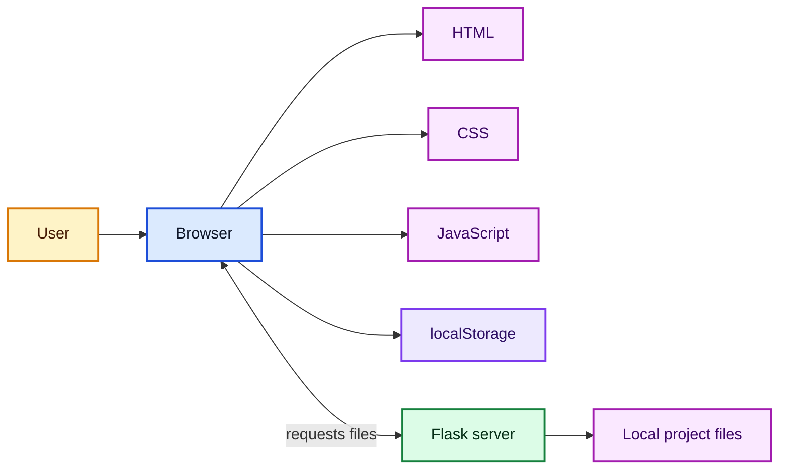

## 7. Markmap-Style Outline

- Universal Coding Basics
  - What code is
    - instructions
    - logic
    - files
    - input and output
  - Universal ideas
    - variable
    - value
    - string
    - number
    - boolean
    - array
    - object
    - function
    - condition
    - loop
    - event
    - return value
    - parameter
    - argument
    - module
    - import
    - library
    - framework
  - Symbol reference
    - assignment
    - comparison
    - logical operators
    - brackets and braces
    - regex
  - How to read code
    - identify file
    - identify block
    - identify variables
    - identify functions
    - identify inputs and outputs
    - identify side effects
    - identify dependencies
  - Frontend and backend
    - user
    - browser
    - HTML
    - CSS
    - JavaScript
    - Flask
    - localStorage

---

---

# Phase 3 — Python Syntax Explained Using This Project

## 1. Why Python Is Used in This Project

Python is used in this project to do a very small but important job: run a local web server and send the app files to the browser.

That means Python is **not** the main logic layer here. Most of the app behavior lives in JavaScript inside the browser. Python mainly does things like:

- create the Flask app
- define routes such as `/`
- send `index.html`, CSS files, and JavaScript files
- choose how to run the server

So in this project:

- **Python is small**
- **JavaScript is large**

This is common for a frontend-heavy web app.

## 2. Full Code Listing of `main.py`

```python
from server import app  # noqa: F401
```

## 3. Full Code Listing of `server.py`

```python
from flask import Flask, send_from_directory, send_file
import os
import sys

app = Flask(__name__, static_folder='.')

@app.route('/')
def index():
    response = send_file('index.html')
    response.headers['Cache-Control'] = 'no-cache, no-store, must-revalidate'
    return response

@app.route('/css/<path:filename>')
def serve_css(filename):
    response = send_from_directory('css', filename)
    response.headers['Cache-Control'] = 'no-cache, no-store, must-revalidate'
    return response

@app.route('/js/<path:filename>')
def serve_js(filename):
    response = send_from_directory('js', filename)
    response.headers['Cache-Control'] = 'no-cache, no-store, must-revalidate'
    return response

if __name__ == '__main__':
    port = int(os.environ.get('PORT', 5000))
    
    if sys.platform == 'win32' or os.environ.get('USE_WAITRESS'):
        from waitress import serve
        print(f'Starting production server with Waitress on http://0.0.0.0:{port}')
        serve(app, host='0.0.0.0', port=port)
    else:
        print(f'Starting development server on http://0.0.0.0:{port}')
        app.run(host='0.0.0.0', port=port)
```

## 4. Python Syntax Explained From Zero

### `import`

`import` means:

"Bring code from another module into this file."

Example:

```python
import os
```

This lets the file use tools from Python's `os` module.

### `from ... import ...`

This means:

"Go into that module and bring only the specific names I want."

Example:

```python
from flask import Flask, send_from_directory, send_file
```

### Variable Assignment

Example:

```python
app = Flask(__name__, static_folder='.')
```

`=` means:

"Take the value on the right and store it in the name on the left."

### Function Definition with `def`

Example:

```python
def index():
```

`def` means:

"Define a function."

A function is a named block of reusable work.

### Indentation

Python uses indentation to show which lines belong inside a block.

Example:

```python
def index():
    response = send_file('index.html')
    return response
```

The indented lines belong to the `index` function.

### Decorators

Example:

```python
@app.route('/')
```

The `@` decorator line gives special meaning to the function below it.

In Flask, this means:

"When the browser asks for this URL path, run the next function."

### `return`

`return` means:

"Send this value back from the function."

Example:

```python
return response
```

### Function Call

Example:

```python
send_file('index.html')
```

The function name is followed by `()`, which means the function is being called.

### `if` Statement

Example:

```python
if sys.platform == 'win32':
```

This means:

"Only run the following block if this condition is true."

### `if __name__ == "__main__"`

This is a very common Python pattern.

It checks:

- is this file being run directly?
- or is this file only being imported by another file?

If it is run directly, the block inside will run.

### Keyword Arguments

Example:

```python
serve(app, host='0.0.0.0', port=port)
```

Here:

- `host='0.0.0.0'`
- `port=port`

are keyword arguments, which means each input is named clearly.

### Strings

Strings are text values.

Example:

```python
'index.html'
```

### Module Usage

A module is a file of code that can be reused.

In this project:

- `os` is a Python module
- `sys` is a Python module
- `flask` is an installed package/module

## 5. Line-by-Line Explanation of `main.py`

### Code

```python
from server import app  # noqa: F401
```

### Line-by-Line

| Line | Code | Plain-English explanation |
|---|---|---|
| 1 | `from server import app  # noqa: F401` | `from server import app` means "go into `server.py` and bring in the value named `app`." The `#` starts a comment. `noqa: F401` tells a code-checking tool not to complain that `app` was imported but not used directly in this file. |

### Important Real-Repo Note

In the current workspace, `main.py` does **not** start the server by itself.

It only imports `app`.

So:

- `python main.py` loads `server.py`
- but the `if __name__ == '__main__':` block in `server.py` does not run just because of that import

That is why the actual runnable server file is still `server.py`.

## 6. Line-by-Line Explanation of `server.py`

### Line-by-Line Table

| Line | Code | Plain-English explanation |
|---|---|---|
| 1 | `from flask import Flask, send_from_directory, send_file` | Bring in the Flask app creator and two helper functions for sending files. |
| 2 | `import os` | Load Python's `os` module so the file can read environment settings like `PORT`. |
| 3 | `import sys` | Load Python's `sys` module so the file can check the platform, such as Windows. |
| 4 | blank line | Blank lines do not run code; they make the file easier to read. |
| 5 | `app = Flask(__name__, static_folder='.')` | Create the Flask app and store it in the variable `app`. `__name__` tells Flask which file this app belongs to. `static_folder='.'` points Flask at the current folder. |
| 6 | blank line | Readability spacing. |
| 7 | `@app.route('/')` | Tell Flask that the next function should run when the browser asks for `/`, which is the home page path. |
| 8 | `def index():` | Define a function named `index`. |
| 9 | `response = send_file('index.html')` | Send the file `index.html` and store the result in `response`. |
| 10 | `response.headers['Cache-Control'] = 'no-cache, no-store, must-revalidate'` | Add a response header telling the browser not to rely heavily on old cached copies. |
| 11 | `return response` | Send the response back from the function so Flask can give it to the browser. |
| 12 | blank line | Readability spacing. |
| 13 | `@app.route('/css/<path:filename>')` | Tell Flask that the next function should handle CSS file requests. |
| 14 | `def serve_css(filename):` | Define a function named `serve_css` that accepts one input called `filename`. |
| 15 | `response = send_from_directory('css', filename)` | Send a file from the `css` folder using the requested file name. |
| 16 | `response.headers['Cache-Control'] = 'no-cache, no-store, must-revalidate'` | Add the same no-cache header for CSS files. |
| 17 | `return response` | Return the response. |
| 18 | blank line | Readability spacing. |
| 19 | `@app.route('/js/<path:filename>')` | Tell Flask that the next function should handle JavaScript file requests. |
| 20 | `def serve_js(filename):` | Define a function named `serve_js` that takes the requested file name. |
| 21 | `response = send_from_directory('js', filename)` | Send a file from the `js` folder. |
| 22 | `response.headers['Cache-Control'] = 'no-cache, no-store, must-revalidate'` | Add the no-cache header for JavaScript files. |
| 23 | `return response` | Return the response. |
| 24 | blank line | Readability spacing. |
| 25 | `if __name__ == '__main__':` | Check whether `server.py` is being run directly. |
| 26 | `port = int(os.environ.get('PORT', 5000))` | Read the `PORT` setting if it exists; otherwise use `5000`. Convert it to an integer number. |
| 27 | blank line | Readability spacing. |
| 28 | `if sys.platform == 'win32' or os.environ.get('USE_WAITRESS'):` | If the app is running on Windows, or if `USE_WAITRESS` is set, use Waitress instead of Flask's built-in server. |
| 29 | `from waitress import serve` | Import Waitress's `serve` function only when it is needed. |
| 30 | `print(f'Starting production server with Waitress on http://0.0.0.0:{port}')` | Print a startup message in the terminal. The `f` string inserts the `port` value into the text. |
| 31 | `serve(app, host='0.0.0.0', port=port)` | Start the Waitress server and serve the Flask app. |
| 32 | `else:` | If the Waitress condition was false, run the next block instead. |
| 33 | `print(f'Starting development server on http://0.0.0.0:{port}')` | Print the development server startup message. |
| 34 | `app.run(host='0.0.0.0', port=port)` | Start Flask's built-in development server. |

## 7. Flask Concepts Explained

### What Flask Is

Flask is a Python web framework. In simple words, it helps Python act like a web server.

### What `app = Flask(...)` Means

This line creates the main Flask app object.

```python
app = Flask(__name__, static_folder='.')
```

You can think of `app` as:

- the main web app
- the central server object
- the thing Flask uses to know how to handle browser requests

### What a Route Means

A route is a rule that connects:

- a URL path
- to a Python function

Example:

```python
@app.route('/')
```

This means:

"When the browser asks for `/`, run the function below."

### What `@app.route("/")` Means

It connects the URL `/` to the next function.

In this project:

- `/` -> `index()`
- `/css/...` -> `serve_css(...)`
- `/js/...` -> `serve_js(...)`

### What `send_file` Means

`send_file('index.html')` means:

"Take this exact file and send it to the browser."

### What `send_from_directory` Means

`send_from_directory('css', filename)` means:

"Go into the `css` folder, find the requested file, and send it."

### How Request / Response Works in This App

| Step | What happens |
|---|---|
| 1 | Browser asks for a path like `/` or `/js/app.js` |
| 2 | Flask checks which route matches |
| 3 | The matching Python function runs |
| 4 | That function builds a response |
| 5 | The response is sent back to the browser |

## 8. Waitress Explained

### What Waitress Is

Waitress is a Python WSGI server. In simple terms, it is another tool for serving Python web apps.

### Why Use It

This project uses Waitress when:

- the app is running on Windows
- or `USE_WAITRESS` is set

It is used because it is better suited for serving the app as a real server than Flask's simple built-in development server.

### Difference from Flask's Built-In Server

| Server | Main use |
|---|---|
| Flask built-in server | simple development use |
| Waitress | more production-friendly serving |

## 9. Mermaid Diagram

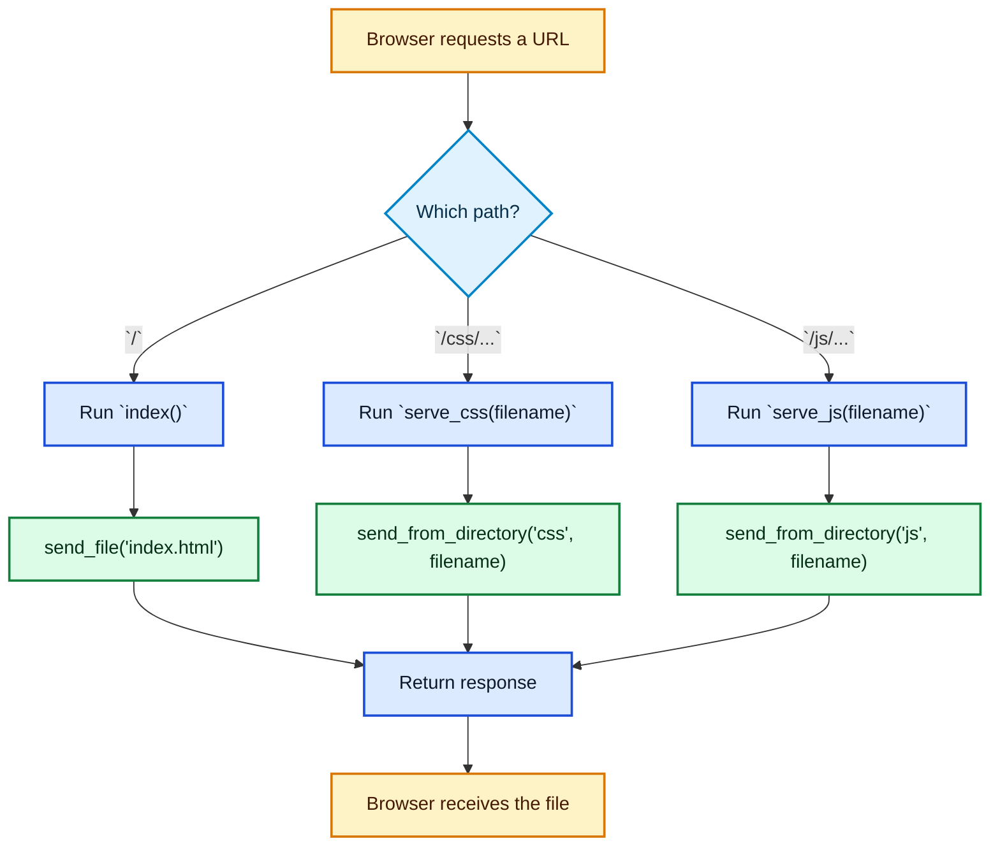

## 10. Edit Guide

### Change the Port

Current line:

```python
port = int(os.environ.get('PORT', 5000))
```

Example change:

```python
port = int(os.environ.get('PORT', 8000))
```

### Add a New Route

Add a new block before the `if __name__ == '__main__':` section.

Example:

```python
@app.route('/about')
def about():
    response = send_file('about.html')
    response.headers['Cache-Control'] = 'no-cache, no-store, must-revalidate'
    return response
```

### Serve a New Folder

Example: add an images folder.

```python
@app.route('/images/<path:filename>')
def serve_images(filename):
    response = send_from_directory('images', filename)
    response.headers['Cache-Control'] = 'no-cache, no-store, must-revalidate'
    return response
```

### Rename an Entry File Safely

If you rename `index.html` to another file name, also change:

```python
response = send_file('index.html')
```

to:

```python
response = send_file('home.html')
```

Important note:

- the Python route and the actual file name must still match

## 11. Markmap-Style Summary

- Python in This Project
  - why Python is used
    - serve files
    - run local web server
    - small backend
  - `main.py`
    - imports `app`
    - does not fully start server by itself in current repo
  - `server.py`
    - imports Flask tools
    - creates app
    - defines routes
    - sends files
    - starts server
  - Python syntax
    - import
    - from import
    - variable assignment
    - def
    - indentation
    - decorator
    - return
    - if
    - if `__name__ == '__main__'`
    - keyword arguments
  - Flask
    - app object
    - routes
    - request
    - response
    - `send_file`
    - `send_from_directory`
  - Waitress
    - production-friendly serving
    - used on Windows or when enabled
  - edit guide
    - change port
    - add route
    - serve folder
    - rename entry file

---

---

# Phase 4 — JavaScript Syntax Basics Before Reading the JS Files

## 1. What JavaScript Does in This Project

### One-Line Answer

JavaScript is the **brain of the frontend**.

### In This Project, JavaScript Does These Jobs

| Job | Real example from this project |
|---|---|
| start the app | `document.addEventListener('DOMContentLoaded', init);` |
| read saved tasks | `Storage.getTasks()` |
| save tasks | `Storage.saveTasks(tasks)` |
| parse typed text | `TaskParser.parseNaturalLanguage(value)` |
| react to clicks | `addEventListener('click', ...)` |
| update the page | `container.innerHTML = ...` |
| show and hide popups | `classList.add('show')`, `classList.remove('show')` |
| use browser storage | `localStorage.getItem(...)` |
| check reminders | `setInterval(checkAlarms, 30000)` |

### Main JS Files

| File | Main job |
|---|---|
| `js/app.js` | main controller |
| `js/storage.js` | save/load/export |
| `js/taskParser.js` | parse natural typed text |
| `js/sampleData.js` | demo tasks |

## 2. Core Syntax

### Quick Table

| Syntax | Simple meaning | Real project-style example |
|---|---|---|
| `var` | create a variable | `var tasks = [];` |
| `let` | create a variable that can change | not used much in this repo, but common JS |
| `const` | create a variable that should not be reassigned | not used much in this repo, but common JS |
| string | text value | `'dark'` |
| number | numeric value | `5000` |
| boolean | `true` or `false` | `task.completed === false` |
| array | list of values | `['work', 'urgent']` |
| object | named values together | `{ title: 'Buy milk' }` |
| function | named block of work | `function loadTasks() { ... }` |
| return | send a value back | `return response;` |
| if / else | choose between paths | `if (!value) { ... } else { ... }` |
| comparison | compare values | `theme === 'dark'` |
| logical operator | combine conditions | `a && b` |
| dot notation | access inside something | `Storage.getTasks()` |
| bracket notation | access by key/index | `match[1]` |

### `var`, `let`, `const`

| Keyword | Meaning | Used in this repo? |
|---|---|---|
| `var` | old-style JS variable | yes, heavily |
| `let` | newer variable that can change | mostly no |
| `const` | newer variable that should stay fixed | mostly no |

Example:

```javascript
var tasks = [];
```

Meaning:

- make a variable
- name it `tasks`
- store an empty list in it

### Strings, Numbers, Booleans

| Type | Example | Meaning |
|---|---|---|
| string | `'high'` | text |
| number | `30` | numeric value |
| boolean | `true` | yes/no style value |

### Arrays

Example:

```javascript
var tags = ['work', 'urgent'];
```

Meaning:

- `[]` means array
- values are separated by commas

### Objects

Example:

```javascript
var task = {
    title: 'Buy groceries',
    priority: 'medium'
};
```

Meaning:

- `{}` means object
- `title:` is a field name
- `'Buy groceries'` is its value

### `if / else`

Example:

```javascript
if (!value) {
    return;
} else {
    showToast('Task Added', 'Done');
}
```

Meaning:

- if there is no value, stop
- otherwise do the other block

### Comparison Operators

| Operator | Meaning | Example |
|---|---|---|
| `===` | strictly equal | `theme === 'dark'` |
| `!==` | strictly not equal | `a !== b` |
| `<` | less than | `hours < 12` |
| `>` | greater than | `diff > 0` |
| `<=` | less than or equal | `diff <= fiveMinutes` |
| `>=` | greater than or equal | `diff >= -60000` |

### Logical Operators

| Operator | Meaning | Example |
|---|---|---|
| `&&` | and | `meridiem === 'pm' && hours < 12` |
| `||` | or | `taskData.priority || 'medium'` |
| `!` | not | `if (!value)` |

### Dot Notation and Bracket Notation

| Style | Example | Meaning |
|---|---|---|
| dot notation | `Storage.getTasks()` | go inside `Storage` and use `getTasks` |
| bracket notation | `match[1]` | get item number 1 from a match result |

## 3. Functions in JS

### Function Types Seen Here

| Function type | Example |
|---|---|
| function declaration | `function loadTasks() { ... }` |
| anonymous function | `function(e) { ... }` |
| function call | `loadTasks()` |

### Function Declaration

```javascript
function loadTasks() {
    tasks = Storage.getTasks();
}
```

Parts:

| Part | Meaning |
|---|---|
| `function` | start a function |
| `loadTasks` | function name |
| `()` | inputs go here |
| `{}` | code block for the function |

### Anonymous Function

```javascript
btn.addEventListener('click', function() {
    closeTaskModal();
});
```

Meaning:

- this function has no special name
- it is passed directly into another function

### Parameters and Return Values

| Term | Meaning | Example |
|---|---|---|
| parameter | input name in function definition | `function deleteTask(id)` |
| argument | real value passed in | `deleteTask('task-1')` |
| return value | value sent back | `return response;` |

## 4. Arrays and Objects

### Array Example with Tasks

```javascript
var tasks = [];
```

Later:

```javascript
tasks.push(newTask);
```

Meaning:

- start with an empty list
- add one task to the end

### Object Example with Tasks

```javascript
var newTask = {
    title: taskData.title,
    priority: taskData.priority || 'medium',
    tags: taskData.tags || []
};
```

### Task Data Shape

| Field | Meaning |
|---|---|
| `title` | task name |
| `priority` | high / medium / low |
| `tags` | list of labels |
| `dueDate` | date value |
| `dueTime` | time text |
| `status` | todo / doing / done |

### Visual: Array vs Object

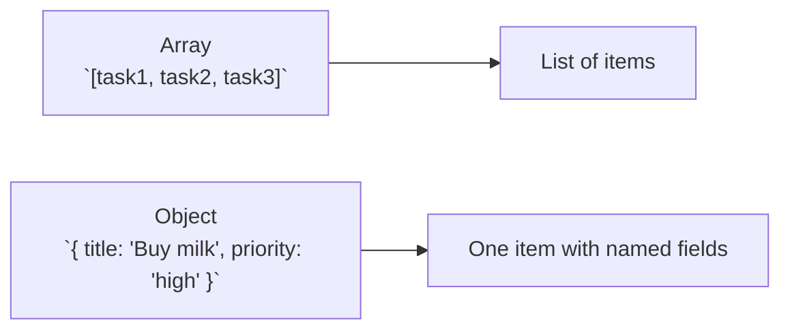

## 5. DOM Basics

DOM means the browser's page structure that JavaScript can read and change.

### Most Important DOM Tools Used Here

| Tool | Real example | Meaning |
|---|---|---|
| `document` | `document.getElementById(...)` | the page itself |
| `getElementById` | `document.getElementById('quickAddInput')` | find one element by ID |
| `querySelector` | `document.querySelector('.theme-text')` | find the first matching element |
| `querySelectorAll` | `document.querySelectorAll('.nav-item')` | find many matching elements |
| `addEventListener` | `btn.addEventListener('click', ...)` | run code when something happens |
| `.value` | `input.value` | read what user typed |
| `.innerHTML` | `container.innerHTML = html` | replace element contents with HTML |
| `.textContent` | `titleEl.textContent = defaultTitle` | replace text only |
| `classList.add/remove/toggle` | `classList.toggle('dark')` | change CSS classes |

### DOM Flow Example

```javascript
var input = document.getElementById('quickAddInput');
var value = input.value.trim();
```

Meaning:

1. find the input box
2. read what the user typed
3. remove extra spaces

### DOM Interaction Diagram

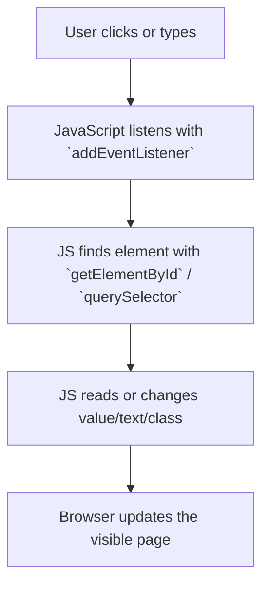

## 6. Browser APIs Used in This Project

Browser APIs are built-in browser tools JavaScript can use.

### APIs Used Here

| API | Real example | Job |
|---|---|---|
| `localStorage` | `localStorage.getItem(...)` | save and load text locally |
| Notifications | `Notification.permission` | browser reminders |
| `Date` | `new Date()` | work with time and dates |
| `Date.now()` | `var now = Date.now();` | current time as a number |
| timers | `setInterval(checkAlarms, 30000)` | repeat checks over time |

### Example: `localStorage`

```javascript
localStorage.setItem(STORAGE_KEY, JSON.stringify(tasks));
```

Meaning:

- turn tasks into text
- save that text in browser storage

### Example: Notifications

```javascript
if (!('Notification' in window) || Notification.permission !== 'granted') return;
```

Meaning:

- stop if notifications are unsupported
- or permission is not granted

## 7. IIFE / Module Pattern

### Real Pattern in This Project

```javascript
var Storage = (function() {
    function getTasks() { ... }

    return {
        getTasks: getTasks
    };
})();
```

### What This Means

| Part | Meaning |
|---|---|
| `var Storage =` | make a variable named `Storage` |
| `function() { ... }` | create a function |
| `(function() { ... })` | wrap the function so it can be treated as a value |
| final `()` | run it immediately |
| `return { ... }` | expose selected functions to the outside |

### Why It Is Useful

| Benefit | Meaning |
|---|---|
| grouping | related code stays together |
| privacy | internal helper values stay hidden |
| public API | only returned functions can be used outside |

### Visual

```mermaid
flowchart LR
    A["IIFE starts"] --> B["private variables and functions exist inside"]
    B --> C["`return { ... }` exposes selected functions"]
    C --> D["outside files can use `Storage.getTasks()`"]
```

## 8. Regex Basics

Regex means a text pattern used to search or match text.

### Real Example from This Project

```javascript
/\btomorrow\b/i
```

### Regex Pieces

| Piece | Meaning |
|---|---|
| `/ ... /` | start and end of regex |
| `\b` | word boundary |
| `tomorrow` | exact text to match |
| `i` | ignore uppercase/lowercase |

### More Real Pieces Used Here

| Pattern | Meaning |
|---|---|
| `(\w+)` | capture a word |
| `\d+` | one or more digits |
| `|` | or |
| `()` | capturing group |
| `g` | find all matches |

### Real Match Example

```javascript
var match = input.match(/(high|low|medium)\s+priority/i);
```

If input contains `high priority`:

| Item | Value |
|---|---|
| `match[0]` | `high priority` |
| `match[1]` | `high` |

## 9. Mermaid Diagrams

### JS Runtime Mental Model

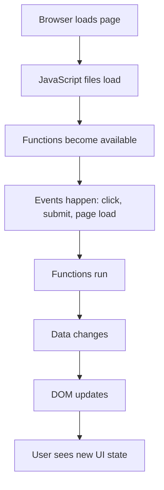

### DOM Interaction Flow

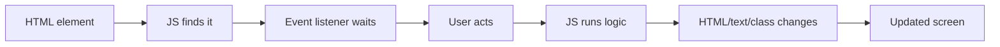

## 10. Markmap-Style Outline

- JavaScript Basics
  - role in this project
    - frontend brain
    - reacts to user actions
    - updates UI
    - saves data
  - core syntax
    - `var`
    - strings
    - numbers
    - booleans
    - arrays
    - objects
    - functions
    - return
    - if / else
    - comparisons
    - logical operators
    - dot notation
    - bracket notation
  - functions
    - declarations
    - anonymous functions
    - parameters
    - return values
  - arrays and objects
    - task lists
    - task objects
  - DOM basics
    - document
    - getElementById
    - querySelector
    - addEventListener
    - input reading
    - innerHTML
    - textContent
    - classList
  - browser APIs
    - localStorage
    - notifications
    - Date
    - timers
  - IIFE pattern
    - wrapper
    - private code
    - returned public functions
  - regex basics
    - pattern
    - flags
    - groups
    - matches

---

# Phase 5 — `storage.js` — Data Persistence and Export Layer

## 1. File Purpose

### One-Line Job

`storage.js` is the app's save/load helper.

### What It Does

| Job | Plain meaning |
|---|---|
| save tasks | put task data into the browser |
| load tasks | read task data back out |
| save theme | remember light mode or dark mode |
| load theme | restore the saved theme on next visit |
| export JSON | download tasks as a `.json` file |
| export CSV | download tasks as a spreadsheet-style `.csv` file |

### Where It Sits in the App

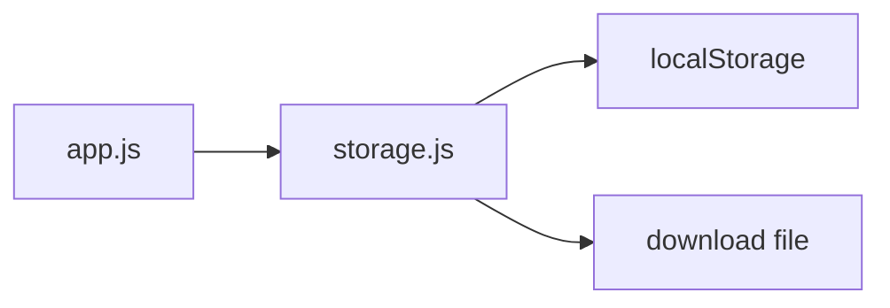

### Real Cross-File Links

| Called from `app.js` | Where |
|---|---|
| `Storage.getTheme()` | theme load block |
| `Storage.getTasks()` | `loadTasks()` |
| `Storage.saveTasks(tasks)` | `saveTasks()` |
| `Storage.saveTheme(...)` | `toggleTheme()` |
| `Storage.exportToJSON(tasks)` | export button click |
| `Storage.exportToCSV(tasks)` | export button click |

---

## 2. Full Code Listing

```javascript
var Storage = (function() {
    var STORAGE_KEY = 'oops-later-tasks';
    var THEME_KEY = 'oops-later-theme';

    function getTasks() {
        try {
            var data = localStorage.getItem(STORAGE_KEY);
            if (!data) return [];
            var tasks = JSON.parse(data);
            return tasks.map(function(task) {
                return Object.assign({}, task, {
                    dueDate: task.dueDate ? new Date(task.dueDate) : undefined,
                    createdAt: new Date(task.createdAt),
                    updatedAt: new Date(task.updatedAt)
                });
            });
        } catch (error) {
            console.error('Error loading tasks:', error);
            return [];
        }
    }

    function saveTasks(tasks) {
        try {
            localStorage.setItem(STORAGE_KEY, JSON.stringify(tasks));
        } catch (error) {
            console.error('Error saving tasks:', error);
        }
    }

    function getTheme() {
        try {
            var theme = localStorage.getItem(THEME_KEY);
            return theme || 'light';
        } catch (error) {
            return 'light';
        }
    }

    function saveTheme(theme) {
        try {
            localStorage.setItem(THEME_KEY, theme);
        } catch (error) {
            console.error('Error saving theme:', error);
        }
    }

    function exportToJSON(tasks) {
        var dataStr = JSON.stringify(tasks, null, 2);
        var dataBlob = new Blob([dataStr], { type: 'application/json' });
        var url = URL.createObjectURL(dataBlob);
        var link = document.createElement('a');
        link.href = url;
        link.download = 'oops-later-tasks-' + new Date().toISOString().split('T')[0] + '.json';
        link.click();
        URL.revokeObjectURL(url);
    }

    function exportToCSV(tasks) {
        var headers = ['Title', 'Status', 'Priority', 'Due Date', 'Due Time', 'Tags', 'Category', 'Completed'];
        var rows = tasks.map(function(task) {
            return [
                task.title,
                task.status,
                task.priority,
                task.dueDate ? task.dueDate.toLocaleDateString() : '',
                task.dueTime || '',
                task.tags.join('; '),
                task.category || '',
                task.completed ? 'Yes' : 'No'
            ];
        });

        var csvContent = [
            headers.join(','),
            rows.map(function(row) {
                return row.map(function(cell) {
                    return '"' + cell + '"';
                }).join(',');
            }).join('\n')
        ].join('\n');

        var dataBlob = new Blob([csvContent], { type: 'text/csv' });
        var url = URL.createObjectURL(dataBlob);
        var link = document.createElement('a');
        link.href = url;
        link.download = 'oops-later-tasks-' + new Date().toISOString().split('T')[0] + '.csv';
        link.click();
        URL.revokeObjectURL(url);
    }

    return {
        getTasks: getTasks,
        saveTasks: saveTasks,
        getTheme: getTheme,
        saveTheme: saveTheme,
        exportToJSON: exportToJSON,
        exportToCSV: exportToCSV
    };
})();
```

---

## 3. Big Picture Explanation

### Before and After View

| Step | What happens |
|---|---|
| 1 | `app.js` has task objects in memory |
| 2 | `storage.js` turns them into text with `JSON.stringify(...)` |
| 3 | browser `localStorage` saves that text |
| 4 | later, `storage.js` reads the text back |
| 5 | `JSON.parse(...)` turns the text back into JS data |
| 6 | date fields are rebuilt into real `Date` objects |

### Why This File Exists

Without `storage.js`, `app.js` would have to:

- know storage key names
- handle JSON conversion itself
- handle export code itself
- repeat theme save/load code

This file keeps that storage work in one place.

---

## 4. IIFE Structure Explained Line by Line

### The Wrapper

```javascript
var Storage = (function() {
    // code here
    return {
        getTasks: getTasks
    };
})();
```

### What This Pattern Is

IIFE means:

**Immediately Invoked Function Expression**

That sounds big, but it only means:

- make a function
- run it right away
- keep some values private inside it
- return only the parts you want outside code to use

### Piece-by-Piece Table

| Part | Simple meaning |
|---|---|
| `var Storage =` | create a variable named `Storage` |
| `(function() { ... })` | treat a function like a value |
| final `()` | run that function immediately |
| `return { ... }` | send out an object of public functions |

### Why It Is Used Here

| Benefit | In this file |
|---|---|
| private keys | `STORAGE_KEY` and `THEME_KEY` stay inside |
| public API | outside code uses `Storage.getTasks()` |
| cleaner structure | save/load/export code stays grouped |

### How `Storage.getTasks()` Becomes Callable

Inside the IIFE:

```javascript
return {
    getTasks: getTasks
};
```

This creates an object like:

```javascript
{
    getTasks: getTasks
}
```

That object gets stored in `Storage`.

So outside the file, `app.js` can do:

```javascript
Storage.getTasks()
```

### Line-by-Line Table for the Wrapper

| Code | Meaning |
|---|---|
| `var Storage =` | make a variable named `Storage` |
| `(function() {` | start an anonymous function and wrap it in parentheses |
| `var STORAGE_KEY = 'oops-later-tasks';` | private value used as the task storage name |
| `var THEME_KEY = 'oops-later-theme';` | private value used as the theme storage name |
| `return { ... };` | expose selected functions to the outside |
| `})();` | end the function, then run it immediately |

### Symbol Notes

| Symbol | Meaning here |
|---|---|
| `=` | store a value |
| `()` | function input area, and also "run now" at the end |
| `{}` | code block or object |
| `:` | object field name to value |
| `;` | end of statement |
| `.` | go inside an object, like `Storage.getTasks` |

---

## 5. Every Function Explained in Full

## 5.1 `getTasks()`

### What Goes In / What Comes Out

| Item | Value |
|---|---|
| input | nothing |
| output | an array of task objects |
| side effect | reads from browser storage |
| called by | `app.js` `loadTasks()` |

### Code

```javascript
function getTasks() {
    try {
        var data = localStorage.getItem(STORAGE_KEY);
        if (!data) return [];
        var tasks = JSON.parse(data);
        return tasks.map(function(task) {
            return Object.assign({}, task, {
                dueDate: task.dueDate ? new Date(task.dueDate) : undefined,
                createdAt: new Date(task.createdAt),
                updatedAt: new Date(task.updatedAt)
            });
        });
    } catch (error) {
        console.error('Error loading tasks:', error);
        return [];
    }
}
```

### Line-by-Line

| Code | Plain-English meaning |
|---|---|
| `function getTasks() {` | make a function named `getTasks` with no input |
| `try {` | try this code and jump to `catch` if an error happens |
| `var data = localStorage.getItem(STORAGE_KEY);` | read saved task text from the browser using the task key |
| `if (!data) return [];` | if nothing was saved, return an empty list |
| `var tasks = JSON.parse(data);` | turn the saved text back into JS data |
| `return tasks.map(function(task) {` | go through each saved task and build a new version |
| `return Object.assign({}, task, {` | copy the old task into a new object, then replace some fields |
| `dueDate: task.dueDate ? new Date(task.dueDate) : undefined,` | if `dueDate` exists, turn it back into a real `Date` object |
| `createdAt: new Date(task.createdAt),` | rebuild `createdAt` as a real `Date` |
| `updatedAt: new Date(task.updatedAt)` | rebuild `updatedAt` as a real `Date` |
| `});` | finish the new object |
| `});` | finish the `map(...)` work |
| `} catch (error) {` | if anything failed, handle the error here |
| `console.error('Error loading tasks:', error);` | print the problem in the browser console |
| `return [];` | fail safely by returning an empty list |
| `}` | end the function |

### Why the Date Conversion Is Needed

`localStorage` saves text only.

That means a real `Date` object becomes text when saved.

So on load, this file rebuilds the dates:

| Saved form | Loaded form |
|---|---|
| `"2026-04-01T10:00:00.000Z"` | `new Date("2026-04-01T10:00:00.000Z")` |

### Small Example

```javascript
var saved = '[{"title":"Study","createdAt":"2026-04-01T10:00:00.000Z"}]';
var tasks = JSON.parse(saved);
```

After `JSON.parse(saved)`, `createdAt` is still text.

After:

```javascript
new Date(tasks[0].createdAt)
```

it becomes a real date object again.

---

## 5.2 `saveTasks(tasks)`

### What Goes In / What Comes Out

| Item | Value |
|---|---|
| input | `tasks` array |
| output | no return value |
| side effect | writes to browser storage |
| called by | `app.js` `saveTasks()` wrapper |

### Code

```javascript
function saveTasks(tasks) {
    try {
        localStorage.setItem(STORAGE_KEY, JSON.stringify(tasks));
    } catch (error) {
        console.error('Error saving tasks:', error);
    }
}
```

### Line-by-Line

| Code | Plain-English meaning |
|---|---|
| `function saveTasks(tasks) {` | make a function named `saveTasks`; it expects one input named `tasks` |
| `try {` | try the save process |
| `localStorage.setItem(STORAGE_KEY, JSON.stringify(tasks));` | turn the tasks array into text, then save that text under the task key |
| `} catch (error) {` | if saving fails, handle the error |
| `console.error('Error saving tasks:', error);` | print the problem in the console |
| `}` | end the function |

### Input and Output Example

Input:

```javascript
[
    { title: 'Study', priority: 'high' },
    { title: 'Call mom', priority: 'low' }
]
```

Saved browser text:

```javascript
'[{"title":"Study","priority":"high"},{"title":"Call mom","priority":"low"}]'
```

---

## 5.3 `getTheme()`

### What Goes In / What Comes Out

| Item | Value |
|---|---|
| input | nothing |
| output | a theme string like `'light'` or `'dark'` |
| side effect | reads from browser storage |
| called by | `app.js` `loadTheme()` |

### Code

```javascript
function getTheme() {
    try {
        var theme = localStorage.getItem(THEME_KEY);
        return theme || 'light';
    } catch (error) {
        return 'light';
    }
}
```

### Line-by-Line

| Code | Plain-English meaning |
|---|---|
| `function getTheme() {` | make a function named `getTheme` |
| `try {` | try to read the saved theme |
| `var theme = localStorage.getItem(THEME_KEY);` | read the theme text from browser storage |
| `return theme || 'light';` | return the saved theme, or return `'light'` if nothing is saved |
| `} catch (error) {` | if reading fails, handle it |
| `return 'light';` | use light mode as a safe default |
| `}` | end the function |

### Why `|| 'light'` Is Used

| Left side | Result |
|---|---|
| `'dark'` | returns `'dark'` |
| `'light'` | returns `'light'` |
| `null` | returns `'light'` |
| empty value | returns `'light'` |

---

## 5.4 `saveTheme(theme)`

### What Goes In / What Comes Out

| Item | Value |
|---|---|
| input | theme text |
| output | no return value |
| side effect | writes to browser storage |
| called by | `app.js` `toggleTheme()` |

### Code

```javascript
function saveTheme(theme) {
    try {
        localStorage.setItem(THEME_KEY, theme);
    } catch (error) {
        console.error('Error saving theme:', error);
    }
}
```

### Line-by-Line

| Code | Plain-English meaning |
|---|---|
| `function saveTheme(theme) {` | make a function named `saveTheme`; it expects a theme input |
| `try {` | try the save |
| `localStorage.setItem(THEME_KEY, theme);` | save the theme text under the theme key |
| `} catch (error) {` | if saving fails, handle it |
| `console.error('Error saving theme:', error);` | print the problem in the console |
| `}` | end the function |

### Real App Example

In `app.js`:

```javascript
Storage.saveTheme(isDark ? 'dark' : 'light');
```

Meaning:

- if dark mode is on, save `'dark'`
- otherwise save `'light'`

---

## 5.5 `exportToJSON(tasks)`

### What Goes In / What Comes Out

| Item | Value |
|---|---|
| input | tasks array |
| output | no normal return value |
| side effect | triggers a browser file download |
| called by | export JSON button click in `app.js` |

### Code

```javascript
function exportToJSON(tasks) {
    var dataStr = JSON.stringify(tasks, null, 2);
    var dataBlob = new Blob([dataStr], { type: 'application/json' });
    var url = URL.createObjectURL(dataBlob);
    var link = document.createElement('a');
    link.href = url;
    link.download = 'oops-later-tasks-' + new Date().toISOString().split('T')[0] + '.json';
    link.click();
    URL.revokeObjectURL(url);
}
```

### Line-by-Line

| Code | Plain-English meaning |
|---|---|
| `function exportToJSON(tasks) {` | make a function that exports the task list as a JSON file |
| `var dataStr = JSON.stringify(tasks, null, 2);` | turn the tasks into formatted JSON text |
| `var dataBlob = new Blob([dataStr], { type: 'application/json' });` | wrap that text into a file-like object |
| `var url = URL.createObjectURL(dataBlob);` | create a temporary browser URL for the file |
| `var link = document.createElement('a');` | create an invisible download link |
| `link.href = url;` | point the link to the temporary file URL |
| `link.download = ... + '.json';` | choose the download file name |
| `link.click();` | act like the user clicked the link |
| `URL.revokeObjectURL(url);` | clean up the temporary URL after use |
| `}` | end the function |

### Why `JSON.stringify(tasks, null, 2)` Has Extra Inputs

| Part | Meaning |
|---|---|
| first input `tasks` | the data to convert |
| second input `null` | do not use a custom replacer |
| third input `2` | indent with 2 spaces for readable formatting |

---

## 5.6 `exportToCSV(tasks)`

### What Goes In / What Comes Out

| Item | Value |
|---|---|
| input | tasks array |
| output | no normal return value |
| side effect | triggers a CSV download |
| called by | export CSV button click in `app.js` |

### Code

```javascript
function exportToCSV(tasks) {
    var headers = ['Title', 'Status', 'Priority', 'Due Date', 'Due Time', 'Tags', 'Category', 'Completed'];
    var rows = tasks.map(function(task) {
        return [
            task.title,
            task.status,
            task.priority,
            task.dueDate ? task.dueDate.toLocaleDateString() : '',
            task.dueTime || '',
            task.tags.join('; '),
            task.category || '',
            task.completed ? 'Yes' : 'No'
        ];
    });

    var csvContent = [
        headers.join(','),
        rows.map(function(row) {
            return row.map(function(cell) {
                return '"' + cell + '"';
            }).join(',');
        }).join('\n')
    ].join('\n');

    var dataBlob = new Blob([csvContent], { type: 'text/csv' });
    var url = URL.createObjectURL(dataBlob);
    var link = document.createElement('a');
    link.href = url;
    link.download = 'oops-later-tasks-' + new Date().toISOString().split('T')[0] + '.csv';
    link.click();
    URL.revokeObjectURL(url);
}
```

### Line-by-Line

| Code | Plain-English meaning |
|---|---|
| `function exportToCSV(tasks) {` | make a function that exports the task list as CSV text |
| `var headers = [...]` | create the top row of column names |
| `var rows = tasks.map(function(task) {` | build one CSV row for each task |
| `return [ ... ];` | return an array of cell values for one task |
| `task.title` | put the task title into the row |
| `task.status` | put the task status into the row |
| `task.priority` | put the task priority into the row |
| `task.dueDate ? task.dueDate.toLocaleDateString() : ''` | if there is a due date, show it as readable text; otherwise use empty text |
| `task.dueTime || ''` | use saved time, or empty text if missing |
| `task.tags.join('; ')` | combine all tags into one text cell separated by `; ` |
| `task.category || ''` | use category if present |
| `task.completed ? 'Yes' : 'No'` | turn true/false into readable words |
| `});` | finish building all task rows |
| `var csvContent = [...]` | build the final CSV text |
| `headers.join(',')` | turn the header array into one comma-separated line |
| `rows.map(function(row) { ... })` | process each row array |
| `row.map(function(cell) { ... })` | process each cell inside the row |
| `return '\"' + cell + '\"';` | wrap each cell in quotes |
| `}).join(',')` | join the cells with commas |
| `}).join('\n')` | join all rows with line breaks |
| `].join('\n');` | join header line and row lines together |
| `var dataBlob = new Blob([csvContent], { type: 'text/csv' });` | make a file-like CSV blob |
| `var url = URL.createObjectURL(dataBlob);` | create a temporary browser URL |
| `var link = document.createElement('a');` | make a temporary download link |
| `link.href = url;` | point the link at the CSV file |
| `link.download = ... + '.csv';` | set the file name |
| `link.click();` | trigger the download |
| `URL.revokeObjectURL(url);` | clean up temporary memory |
| `}` | end the function |

### CSV Shape Preview

```text
Title,Status,Priority,Due Date,Due Time,Tags,Category,Completed
"Study","todo","high","4/1/2026","5:00 PM","college; exam","school","No"
```

---

## 6. `localStorage` Explained from Zero

### What It Is

`localStorage` is browser memory that saves simple text data.

### Think of It Like

| Idea | Meaning |
|---|---|
| key | the storage name |
| value | the saved text under that name |

### Real Keys in This File

| Key variable | Real key text |
|---|---|
| `STORAGE_KEY` | `oops-later-tasks` |
| `THEME_KEY` | `oops-later-theme` |

### Basic Example

```javascript
localStorage.setItem('username', 'Asha');
var name = localStorage.getItem('username');
```

Result:

| Step | Value |
|---|---|
| saved | `'Asha'` |
| loaded | `'Asha'` |

### Important Limitation

`localStorage` stores strings only.

So this works:

```javascript
localStorage.setItem('theme', 'dark');
```

But objects and arrays must first become text.

That is why this file uses `JSON.stringify(...)`.

### Why It Is Good for This App

| Benefit | Why it helps here |
|---|---|
| simple | no database setup |
| local | data stays in the same browser |
| persistent | data stays after reload |

### Limitation for This App

| Limitation | Meaning |
|---|---|
| browser-only | data does not magically sync to another browser |
| string-only | objects must be converted |
| user can clear it | clearing browser storage removes saved data |

---

## 7. `JSON.stringify` and `JSON.parse`

### `JSON.stringify(...)`

Job:

- JS object/array in
- text out

Example:

```javascript
var task = { title: 'Study', priority: 'high' };
var text = JSON.stringify(task);
```

Result:

```javascript
'{"title":"Study","priority":"high"}'
```

### `JSON.parse(...)`

Job:

- text in
- JS object/array out

Example:

```javascript
var text = '{"title":"Study","priority":"high"}';
var task = JSON.parse(text);
```

Result:

```javascript
{ title: 'Study', priority: 'high' }
```

### Side-by-Side Table

| Tool | Input | Output |
|---|---|---|
| `JSON.stringify(...)` | JS array/object | text |
| `JSON.parse(...)` | text | JS array/object |

### Save/Load Mental Model

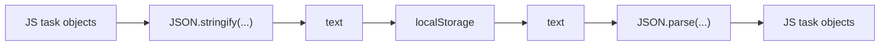

---

## 8. Data Shape

### What Saved Task Data Looks Like

This file does not create the whole task structure by itself, but it saves and reloads task objects that look roughly like this:

```javascript
{
    title: 'Study',
    status: 'todo',
    priority: 'high',
    dueDate: '2026-04-01T00:00:00.000Z',
    dueTime: '5:00 PM',
    tags: ['college', 'exam'],
    category: 'school',
    completed: false,
    createdAt: '2026-04-01T09:00:00.000Z',
    updatedAt: '2026-04-01T09:30:00.000Z'
}
```

### Important Note

When saved:

- dates become text

When loaded through `getTasks()`:

- dates are turned back into `Date` objects for `dueDate`, `createdAt`, and `updatedAt`

---

## 9. Mermaid Sequence Diagram

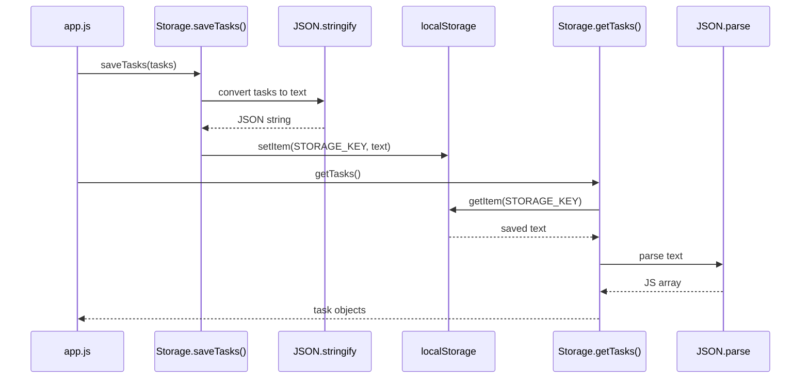

---

## 10. Edit Guide

## 10.1 Add a New Saved Setting

Example goal:

save a font size preference.

### Step 1: Add a new private key

In `storage.js`, near the top:

```javascript
var FONT_SIZE_KEY = 'oops-later-font-size';
```

### Step 2: Add a getter

```javascript
function getFontSize() {
    try {
        var size = localStorage.getItem(FONT_SIZE_KEY);
        return size || 'medium';
    } catch (error) {
        return 'medium';
    }
}
```

### Step 3: Add a saver

```javascript
function saveFontSize(size) {
    try {
        localStorage.setItem(FONT_SIZE_KEY, size);
    } catch (error) {
        console.error('Error saving font size:', error);
    }
}
```

### Step 4: Expose both functions in the returned object

Add them here:

```javascript
return {
    getTasks: getTasks,
    saveTasks: saveTasks,
    getTheme: getTheme,
    saveTheme: saveTheme,
    getFontSize: getFontSize,
    saveFontSize: saveFontSize,
    exportToJSON: exportToJSON,
    exportToCSV: exportToCSV
};
```

### Step 5: Use them from `app.js`

Example:

```javascript
var size = Storage.getFontSize();
Storage.saveFontSize('large');
```

## 10.2 Change Storage Key Names

Change these lines:

```javascript
var STORAGE_KEY = 'oops-later-tasks';
var THEME_KEY = 'oops-later-theme';
```

Example:

```javascript
var STORAGE_KEY = 'ol-tasks';
var THEME_KEY = 'ol-theme';
```

Important:

- old saved data under the old key will no longer be read unless you migrate it

## 10.3 Add a New Export Field

If you add a new field like `energyLevel`, update:

1. header row
2. each exported task row

Example:

```javascript
var headers = ['Title', 'Status', 'Priority', 'Energy'];
```

And inside the returned row:

```javascript
return [
    task.title,
    task.status,
    task.priority,
    task.energyLevel || ''
];
```

## 10.4 Safely Change CSV Columns

Checklist:

| Rule | Why |
|---|---|
| keep header count and row value count equal | avoids broken CSV columns |
| keep the same order in both places | prevents wrong column mapping |
| use fallback values like `|| ''` | avoids showing `undefined` in exported files |

---

## 11. Markmap-Style Outline

- `storage.js`
  - role
    - save tasks
    - load tasks
    - save theme
    - load theme
    - export JSON
    - export CSV
  - wrapper pattern
    - IIFE
    - private keys
    - returned public functions
  - functions
    - `getTasks()`
      - read `localStorage`
      - parse JSON
      - rebuild `Date` objects
    - `saveTasks(tasks)`
      - stringify tasks
      - save text
    - `getTheme()`
      - read theme
      - fallback to `light`
    - `saveTheme(theme)`
      - store theme text
    - `exportToJSON(tasks)`
      - stringify
      - blob
      - download
    - `exportToCSV(tasks)`
      - headers
      - row mapping
      - CSV text
      - download
  - concepts
    - `localStorage`
    - `JSON.stringify`
    - `JSON.parse`
    - `Blob`
    - download link
  - edit guide
    - add saved setting
    - change key names
    - add export field
    - change CSV columns

---

# Phase 6 — `taskParser.js` — Natural Language Parsing Explained

## 1. File Purpose

### One-Line Job

`taskParser.js` reads normal typed text and turns it into structured task data.

### What "Natural Language Parsing" Means

It means:

- the user types everyday words
- the code looks for useful patterns
- the code pulls out meaning from that text

Example:

```text
Submit assignment tomorrow #college high priority
```

The parser tries to separate that into:

| Part found | Meaning |
|---|---|
| `Submit assignment` | task title |
| `tomorrow` | due date |
| `#college` | tag |
| `high priority` | priority |

### Big Picture

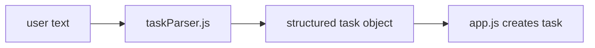

### Real Cross-File Use

| `app.js` use | Meaning |
|---|---|
| `TaskParser.parse(prefillText)` | fills the task modal from typed text |
| `TaskParser.parseNaturalLanguage(value)` | quick-add parser for the main input |

---

## 2. Full Code Listing

```javascript
var TaskParser = (function() {
    var weekdays = ['sunday', 'monday', 'tuesday', 'wednesday', 'thursday', 'friday', 'saturday'];
    
    function getNextWeekday(targetDay, addWeeks) {
        addWeeks = addWeeks || 0;
        var today = new Date();
        var currentDay = today.getDay();
        var targetDayIndex = weekdays.indexOf(targetDay.toLowerCase());
        
        if (targetDayIndex === -1) return null;
        
        var daysUntilTarget = targetDayIndex - currentDay;
        if (daysUntilTarget <= 0) {
            daysUntilTarget += 7;
        }
        
        daysUntilTarget += (addWeeks * 7);
        
        var result = new Date();
        result.setDate(today.getDate() + daysUntilTarget);
        return result;
    }
    
    function parseNaturalLanguage(input) {
        var title = input;
        var priority = 'medium';
        var dueDate = undefined;
        var dueTime = undefined;
        var tags = [];

        var priorityRegex = /(high|low|medium)\s+priority/i;
        var priorityMatch = input.match(priorityRegex);
        if (priorityMatch) {
            priority = priorityMatch[1].toLowerCase();
            title = title.replace(priorityRegex, '').trim();
        }

        var tagRegex = /#(\w+)/g;
        var tagMatch;
        while ((tagMatch = tagRegex.exec(input)) !== null) {
            tags.push(tagMatch[1]);
            title = title.replace(tagMatch[0], '').trim();
        }

        var timeRegex = /\b(\d{1,2}):?(\d{2})?\s*(am|pm)?\b/i;
        var timeMatch = input.match(timeRegex);
        if (timeMatch) {
            var hours = parseInt(timeMatch[1]);
            var minutes = timeMatch[2] ? parseInt(timeMatch[2]) : 0;
            var meridiem = timeMatch[3] ? timeMatch[3].toLowerCase() : null;

            if (meridiem === 'pm' && hours < 12) hours += 12;
            if (meridiem === 'am' && hours === 12) hours = 0;

            dueTime = hours.toString().padStart(2, '0') + ':' + minutes.toString().padStart(2, '0');
            title = title.replace(timeMatch[0], '').trim();
        }

        var nextWeekDayRegex = /\bnext\s+week\s+(monday|tuesday|wednesday|thursday|friday|saturday|sunday)\b/i;
        var thisWeekDayRegex = /\bthis\s+(monday|tuesday|wednesday|thursday|friday|saturday|sunday)\b/i;
        var onWeekDayRegex = /\bon\s+(monday|tuesday|wednesday|thursday|friday|saturday|sunday)\b/i;
        var justWeekDayRegex = /\b(monday|tuesday|wednesday|thursday|friday|saturday|sunday)\b/i;
        var tomorrowRegex = /\btomorrow\b/i;
        var todayRegex = /\btoday\b/i;
        var nextWeekRegex = /\bnext\s+week\b/i;
        var inDaysRegex = /\bin\s+(\d+)\s+days?\b/i;
        var inWeeksRegex = /\bin\s+(\d+)\s+weeks?\b/i;
        var specificDateRegex = /\b(\d{1,2})\/(\d{1,2})(?:\/(\d{2,4}))?\b/;

        var nextWeekDayMatch = input.match(nextWeekDayRegex);
        var thisWeekDayMatch = input.match(thisWeekDayRegex);
        var onWeekDayMatch = input.match(onWeekDayRegex);
        var inDaysMatch = input.match(inDaysRegex);
        var inWeeksMatch = input.match(inWeeksRegex);

        if (nextWeekDayMatch) {
            dueDate = getNextWeekday(nextWeekDayMatch[1], 1);
            title = title.replace(nextWeekDayRegex, '').trim();
        } else if (thisWeekDayMatch) {
            dueDate = getNextWeekday(thisWeekDayMatch[1], 0);
            title = title.replace(thisWeekDayRegex, '').trim();
        } else if (onWeekDayMatch) {
            dueDate = getNextWeekday(onWeekDayMatch[1], 0);
            title = title.replace(onWeekDayRegex, '').trim();
        } else if (inDaysMatch) {
            dueDate = new Date();
            dueDate.setDate(dueDate.getDate() + parseInt(inDaysMatch[1]));
            title = title.replace(inDaysRegex, '').trim();
        } else if (inWeeksMatch) {
            dueDate = new Date();
            dueDate.setDate(dueDate.getDate() + (parseInt(inWeeksMatch[1]) * 7));
            title = title.replace(inWeeksRegex, '').trim();
        } else if (tomorrowRegex.test(input)) {
            dueDate = new Date();
            dueDate.setDate(dueDate.getDate() + 1);
            title = title.replace(tomorrowRegex, '').trim();
        } else if (todayRegex.test(input)) {
            dueDate = new Date();
            title = title.replace(todayRegex, '').trim();
        } else if (nextWeekRegex.test(input)) {
            dueDate = new Date();
            dueDate.setDate(dueDate.getDate() + 7);
            title = title.replace(nextWeekRegex, '').trim();
        } else {
            var justWeekDayMatch = input.match(justWeekDayRegex);
            if (justWeekDayMatch && !timeMatch) {
                dueDate = getNextWeekday(justWeekDayMatch[1], 0);
                title = title.replace(justWeekDayRegex, '').trim();
            } else {
                var dateMatch = input.match(specificDateRegex);
                if (dateMatch) {
                    var month = parseInt(dateMatch[1]) - 1;
                    var day = parseInt(dateMatch[2]);
                    var year = dateMatch[3] ? parseInt(dateMatch[3]) : new Date().getFullYear();
                    dueDate = new Date(year, month, day);
                    title = title.replace(dateMatch[0], '').trim();
                }
            }
        }

        title = title.replace(/\s+/g, ' ').trim();

        return {
            title: title,
            priority: priority,
            dueDate: dueDate,
            dueTime: dueTime,
            tags: tags
        };
    }

    return {
        parseNaturalLanguage: parseNaturalLanguage,
        parse: parseNaturalLanguage
    };
})();
```

---

## 3. Big Picture Explanation

### Parser Flow

| Step | What the file does |
|---|---|
| 1 | start with full input text |
| 2 | look for priority words |
| 3 | look for tags |
| 4 | look for time |
| 5 | look for date words or date formats |
| 6 | remove those parts from the title |
| 7 | clean extra spaces |
| 8 | return one object |

### Returned Object Shape

```javascript
{
    title: 'Submit assignment',
    priority: 'high',
    dueDate: Date object or undefined,
    dueTime: '14:00' or undefined,
    tags: ['college']
}
```

---

## 4. Syntax Patterns Used in This File

### Quick Syntax Map

| Syntax | Meaning in this file | Example |
|---|---|---|
| `var` | create a variable | `var title = input;` |
| `function` | create a function | `function parseNaturalLanguage(input)` |
| `()` | function input area or function call | `input.match(...)` |
| `{}` | code block or object | `return { title: title }` |
| `[]` | array or array access | `weekdays[0]`, `tags = []` |
| `.` | go inside something | `input.match(...)` |
| `match()` | search text with regex | `input.match(priorityRegex)` |
| `exec()` | search repeatedly with regex | `tagRegex.exec(input)` |
| `push()` | add to array | `tags.push(tagMatch[1])` |
| `replace()` | remove or change text | `title.replace(...)` |
| `trim()` | remove extra spaces at start/end | `title.trim()` |
| `Date` | work with dates | `new Date()` |
| `return` | send value back | `return { ... }` |

### What Goes In / What Comes Out

| Function | Input | Output |
|---|---|---|
| `getNextWeekday(targetDay, addWeeks)` | weekday name, optional extra weeks | a `Date` or `null` |
| `parseNaturalLanguage(input)` | raw user text | parsed task object |

---

## 5. Regex From Zero

### What Regex Is

Regex means:

- a text pattern
- used to find matching text

### Shape of a Regex

```javascript
/pattern/flags
```

### Parts

| Part | Meaning |
|---|---|
| first `/` | regex starts |
| `pattern` | the rule to match text |
| last `/` | regex ends |
| `flags` | extra behavior like ignore case |

### Important Regex Symbols Used Here

| Symbol | Simple meaning |
|---|---|
| `|` | or |
| `()` | capture part of the match |
| `\w` | word character: letters, numbers, underscore |
| `+` | one or more |
| `?` | optional |
| `\d` | digit |
| `\s` | whitespace / space |
| `\b` | word boundary |
| `g` | global, keep finding more matches |
| `i` | case-insensitive |

### Example

```javascript
/#(\w+)/g
```

It means:

| Piece | Meaning |
|---|---|
| `#` | match a real hash symbol |
| `(\w+)` | capture one or more word characters after it |
| `g` | keep finding all tags, not just the first one |

### Capturing Groups

In this regex:

```javascript
/(high|low|medium)\s+priority/i
```

the part inside `()` is a capturing group.

If the text is:

```text
high priority
```

then:

| Value | Meaning |
|---|---|
| `match[0]` | full matched text: `high priority` |
| `match[1]` | first captured part: `high` |

That is why the code can do:

```javascript
priority = priorityMatch[1].toLowerCase();
```

---

## 6. Every Regex in This File

## 6.1 Priority Regex

```javascript
/(high|low|medium)\s+priority/i
```

| Piece | Meaning |
|---|---|
| `(high|low|medium)` | match one of these three words |
| `\s+` | then one or more spaces |
| `priority` | then the word `priority` |
| `i` | allow `HIGH`, `High`, `high`, etc. |

Matches:

- `high priority`
- `Low Priority`

Does not match:

- `critical`
- `priority high`

Why it exists:

- to detect priority words and store them separately

## 6.2 Tag Regex

```javascript
/#(\w+)/g
```

| Piece | Meaning |
|---|---|
| `#` | start with a hash |
| `(\w+)` | capture the tag name |
| `g` | find all tags |

Matches:

- `#college`
- `#work`

Does not match:

- `college`
- `#work-home` because `-` is not matched by `\w`

Why it exists:

- to collect tags into the `tags` array

## 6.3 Time Regex

```javascript
/\b(\d{1,2}):?(\d{2})?\s*(am|pm)?\b/i
```

| Piece | Meaning |
|---|---|
| `\b` | start at a word boundary |
| `(\d{1,2})` | capture 1 or 2 digits for hours |
| `:?` | optional colon |
| `(\d{2})?` | optional 2-digit minutes |
| `\s*` | optional spaces |
| `(am|pm)?` | optional `am` or `pm` |
| final `\b` | end at a word boundary |
| `i` | allow `AM`, `Pm`, etc. |

Matches:

- `5pm`
- `5:30 pm`
- `09:45`

Does not match:

- `at evening`
- `5:3`

Why it exists:

- to pull a time out of normal text

## 6.4 Next Week + Weekday Regex

```javascript
/\bnext\s+week\s+(monday|tuesday|wednesday|thursday|friday|saturday|sunday)\b/i
```

Matches:

- `next week monday`
- `Next Week Friday`

Why it exists:

- to find a weekday in the following week

## 6.5 This Weekday Regex

```javascript
/\bthis\s+(monday|tuesday|wednesday|thursday|friday|saturday|sunday)\b/i
```

Matches:

- `this monday`
- `this friday`

Why it exists:

- to read phrases that start with `this`

## 6.6 On Weekday Regex

```javascript
/\bon\s+(monday|tuesday|wednesday|thursday|friday|saturday|sunday)\b/i
```

Matches:

- `on monday`
- `on sunday`

Why it exists:

- to support sentence-style input

## 6.7 Just Weekday Regex

```javascript
/\b(monday|tuesday|wednesday|thursday|friday|saturday|sunday)\b/i
```

Matches:

- `monday`
- `friday`

Why it exists:

- to catch weekday-only input if the more specific patterns did not match

## 6.8 Tomorrow Regex

```javascript
/\btomorrow\b/i
```

Matches:

- `tomorrow`

Why it exists:

- to set due date to tomorrow

## 6.9 Today Regex

```javascript
/\btoday\b/i
```

Matches:

- `today`

Why it exists:

- to set due date to today

## 6.10 Next Week Regex

```javascript
/\bnext\s+week\b/i
```

Matches:

- `next week`

Why it exists:

- to add 7 days when no weekday is given

## 6.11 In Days Regex

```javascript
/\bin\s+(\d+)\s+days?\b/i
```

| Piece | Meaning |
|---|---|
| `in` | match the word `in` |
| `(\d+)` | capture one or more digits |
| `days?` | match `day` or `days` |

Matches:

- `in 3 days`
- `in 1 day`

Why it exists:

- to support relative dates by number of days

## 6.12 In Weeks Regex

```javascript
/\bin\s+(\d+)\s+weeks?\b/i
```

Matches:

- `in 2 weeks`
- `in 1 week`

Why it exists:

- to support relative dates by number of weeks

## 6.13 Specific Date Regex

```javascript
/\b(\d{1,2})\/(\d{1,2})(?:\/(\d{2,4}))?\b/
```

| Piece | Meaning |
|---|---|
| `(\d{1,2})` | month as 1 or 2 digits |
| `\/` | slash |
| `(\d{1,2})` | day as 1 or 2 digits |
| `(?: ... )?` | optional non-capturing group |
| `\/(\d{2,4})` | optional year |

Matches:

- `4/1`
- `04/01`
- `4/1/2026`

Why it exists:

- to support direct typed dates

---

## 7. Full Walkthrough Example

### Input

```text
Submit assignment tomorrow #college high priority
```

### Step-by-Step Table

| Step | What the parser checks | Result |
|---|---|---|
| 1 | start values | `title = full input`, `priority = 'medium'`, `tags = []` |
| 2 | priority regex | finds `high priority` |
| 3 | update priority | `priority = 'high'` |
| 4 | remove priority text from title | title becomes `Submit assignment tomorrow #college` |
| 5 | tag regex loop | finds `#college` |
| 6 | push tag | `tags = ['college']` |
| 7 | remove tag from title | title becomes `Submit assignment tomorrow` |
| 8 | time regex | no match |
| 9 | weekday/date regex chain | `tomorrow` matches |
| 10 | create date | `dueDate = new Date()` then add 1 day |
| 11 | remove `tomorrow` from title | title becomes `Submit assignment` |
| 12 | clean spaces | still `Submit assignment` |
| 13 | return object | final parsed result returned |

### Final Returned Object

```javascript
{
    title: 'Submit assignment',
    priority: 'high',
    dueDate: new Date(...tomorrow...),
    dueTime: undefined,
    tags: ['college']
}
```

### Visual Flow

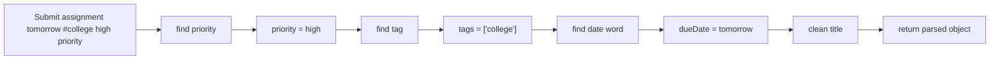

---

## 8. Returned Object Explained

| Field | Type | Meaning |
|---|---|---|
| `title` | string | the cleaned task name with special words removed |
| `priority` | string | `high`, `medium`, or `low` |
| `dueDate` | `Date` or `undefined` | parsed date if found |
| `dueTime` | string or `undefined` | parsed time in `HH:MM` style |
| `tags` | array | all found tag names |

### Important Note

This parser returns only these 5 fields.

It does not create:

- task `id`
- `status`
- `completed`
- other app-level fields

Those are added later by `app.js`.

---

## 9. Mermaid Flowchart

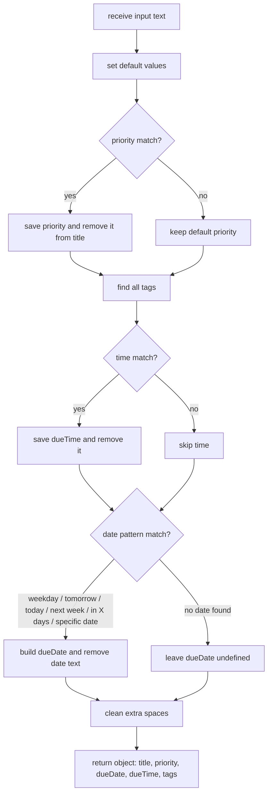

---

## 10. Edit Guide

## 10.1 Add a New Priority Like `critical`

Current line:

```javascript
var priorityRegex = /(high|low|medium)\s+priority/i;
```

Change to:

```javascript
var priorityRegex = /(critical|high|low|medium)\s+priority/i;
```

Also make sure the default app/UI accepts that new value later in `app.js` and the HTML select if needed.

## 10.2 Add a New Date Keyword

### Repo-Truth Note

`next week` is already supported in the current file.

So here is a real example for a new keyword:

`next month`

### Step 1: add a regex

```javascript
var nextMonthRegex = /\bnext\s+month\b/i;
```

### Step 2: add a new condition in the date chain

Example insertion near the other date checks:

```javascript
} else if (nextMonthRegex.test(input)) {
    dueDate = new Date();
    dueDate.setMonth(dueDate.getMonth() + 1);
    title = title.replace(nextMonthRegex, '').trim();
```

## 10.3 Add a New Tag Rule

Current tag regex:

```javascript
var tagRegex = /#(\w+)/g;
```

If you want to allow hyphenated tags like `#work-home`, change it to:

```javascript
var tagRegex = /#([\w-]+)/g;
```

## 10.4 Change Default Priority

Current line:

```javascript
var priority = 'medium';
```

Example change:

```javascript
var priority = 'low';
```

That means:

- if no priority words are found
- the parser returns `low`

---

## 11. Markmap-Style Outline

- `taskParser.js`
  - job
    - read normal typed text
    - extract task fields
  - public API
    - `parseNaturalLanguage(input)`
    - `parse(input)` alias
  - helper
    - `getNextWeekday(targetDay, addWeeks)`
  - extracted fields
    - `title`
    - `priority`
    - `dueDate`
    - `dueTime`
    - `tags`
  - regex groups
    - priority
    - tags
    - time
    - weekday phrases
    - tomorrow
    - today
    - next week
    - in X days
    - in X weeks
    - specific date
  - cleanup
    - remove matched text
    - trim spaces
  - returned object
    - simple parsed task data
  - edit guide
    - add priority
    - add date keyword
    - change tag rules
    - change default priority

---

# Phase 7 — `app.js` — The Main Application Brain

## 1. File Purpose

### One-Line Job

`app.js` is the main controller of the whole frontend.

### Why It Is the "Brain"

It is the file that:

- starts the app
- reads user input
- asks other files for help
- creates and updates task objects
- decides which view to show
- draws the HTML for the current screen
- handles reminders, drag-and-drop, search, sample data, and Energy Mode

### Real Connections

| Connected file / API | How `app.js` uses it |
|---|---|
| `index.html` | reads buttons, inputs, modals, containers |
| `storage.js` | loads tasks/theme, saves tasks/theme, exports files |
| `taskParser.js` | turns typed text into structured task data |
| `sampleData.js` | loads demo tasks |
| `localStorage` | trash, welcome flag, notification flags |
| `Notification` | browser reminders |
| `Date` | due dates, filtering, reminders, analytics |

### Real Repo Note

This file does **not** have functions literally named:

- `createTask()`
- `renderTasks()`
- `switchTab()`

The real equivalents are:

| Requested name | Real function here |
|---|---|
| `createTask()` | `addTask()` and `createTaskFromModal()` |
| `renderTasks()` | `renderView()` |
| `switchTab()` | `setActiveView()` |

---

## 2. Full File Structure Map

### Why This Section Uses a Map Instead of One Giant Code Wall

`app.js` is very large, so this guide breaks it into logical chunks instead of pasting one huge unreadable block.

### Chunk Map

| Area | Main functions |
|---|---|
| startup | `init()`, `migrateTasks()` |
| Energy Mode | `setupEnergyMode()`, `showEnergySuggestions()`, `getEnergyCandidates()`, `getEnergyMatch()` |
| focus / now slot | `startNowTask()`, `clearNowTask()`, `renderNowSlot()` |
| load/save | `loadTheme()`, `loadTasks()`, `saveTasks()`, `loadTrash()`, `saveTrash()` |
| event wiring | `setupEventListeners()`, `setupKeyboardShortcuts()` |
| new task modal | `openNewTaskModal()`, `setupNewTaskModal()`, `createTaskFromModal()` |
| search | `performSearch()`, `setupGlobalSearch()`, `performGlobalSearch()` |
| reminders | `requestNotificationPermission()`, `startAlarmChecker()`, `checkAlarms()` |
| views | `setActiveView()`, `isTaskVisibleInView()`, `getPreferredViewForTask()` |
| task creation and update | `handleQuickAdd()`, `addTask()`, `updateTask()` |
| task actions | `deleteTask()`, `restoreTask()`, `moveTask()`, `snoozeTask()`, `togglePin()`, `duplicateTask()` |
| subtasks and bulk actions | `addSubtask()`, `toggleSubtask()`, `bulkDelete()`, `bulkMove()` |
| rendering | `renderView()`, `renderBoardView()`, `renderTodayView()`, `renderUpcomingView()`, `renderAnalyticsView()`, `renderTrashView()`, `renderSettingsView()`, `renderTaskCard()` |
| task modal and inline edit | `openTaskModal()`, `renderTaskModal()`, `startInlineEdit()` |
| drag and drop | `handleDragStart()`, `handleDrop()` |
| onboarding and feedback | `checkWelcome()`, `loadSampleTasks()`, `showToast()`, `showUndoToast()` |
| helper output | date formatting, HTML escaping, SVG icon functions |

---

## 3. Architectural Overview

### Big Picture Diagram

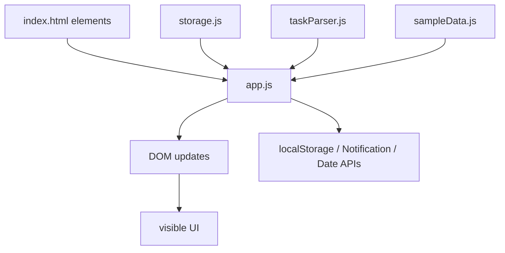

### Cross-File Table

| Connection | Real code shape | Why it matters |
|---|---|---|
| HTML -> JS | `document.getElementById(...)` | `app.js` finds inputs, buttons, modals, and containers |
| HTML -> JS | `document.querySelectorAll('.nav-item')` | view switching works |
| JS -> Storage | `Storage.getTasks()` | saved tasks load on startup |
| JS -> Storage | `Storage.saveTasks(tasks)` | every change persists |
| JS -> Parser | `TaskParser.parseNaturalLanguage(value)` | quick-add text is understood |
| JS -> Parser | `TaskParser.parse(prefillText)` | modal prefill works |
| JS -> Sample data | `SampleData.getSampleTasks()` | welcome screen can load demo tasks |
| HTML inline calls -> JS | `App.handleDrop(...)`, `App.handleDragStart(...)` | drag-and-drop works from generated HTML |

---

## 4. Function Inventory Table

### Main Function Map

| Function / block | Purpose | Inputs | Outputs | Calls | Called by |
|---|---|---|---|---|---|
| `init()` | starts the app | none | none | load/setup/render functions | `DOMContentLoaded` |
| `migrateTasks()` | normalizes old saved task data | none | none | `saveTasks()` | `init()` |
| `setupEnergyMode()` | wires Energy Mode modal | none | none | `showEnergySuggestions()` | `init()` |
| `loadTheme()` | restores dark/light mode | none | none | `Storage.getTheme()` | `init()` |
| `loadTasks()` | loads main tasks | none | none | `Storage.getTasks()` | `init()` |
| `saveTasks()` | saves main tasks | none | none | `Storage.saveTasks()` | many task actions |
| `loadTrash()` | loads deleted tasks | none | none | `localStorage.getItem()` | `init()` |
| `setupEventListeners()` | wires clicks and submits | none | none | many handlers | `init()` |
| `openNewTaskModal(prefillText)` | opens the new task popup | optional text | none | `TaskParser.parse()` | quick add / buttons |
| `createTaskFromModal()` | builds a task from modal fields | none | none | `saveTasks()`, `renderView()` | modal save button |
| `handleQuickAdd(e)` | quick-add input submit flow | submit event | none | parser + `addTask()` | quick add form |
| `addTask(taskData)` | creates a standard task object | task data | new task object | `generateId()`, `saveTasks()`, `renderView()` | quick add, sample load, duplicate |
| `updateTask(id, updates)` | edits one task | id + update object | none | `saveTasks()`, `renderView()` | many actions |
| `deleteTask(id, permanent)` | moves task to trash or removes it | id, flag | none | `saveTrash()`, `saveTasks()` | action menus |
| `restoreTask(id)` | puts task back from trash | task id | none | `saveTasks()`, `saveTrash()` | trash view |
| `moveTask(id, newStatus)` | moves task between todo/doing/done | id + status | none | `updateTask()` | drag/drop, menus |
| `togglePin(id)` | pins/unpins task | id | none | `updateTask()` | menu action |
| `duplicateTask(id)` | clones a task | id | none | `addTask()` | menu action |
| `checkAlarms()` | checks due reminders | none | none | `showNotificationWithSound()` | timer |
| `setActiveView(view)` | changes visible tab/view | view name | none | `renderView()` | nav buttons |
| `renderView()` | draws the current main screen | none | none | render helpers | startup and many actions |
| `renderBoardView()` | builds board HTML | none | HTML string | `renderColumn()` | `renderView()` |
| `renderTaskCard(task)` | builds one card's HTML | task object | HTML string | icon/date helpers | render helpers |
| `setupViewEventListeners()` | re-wires events after rendering | none | none | action handlers | `renderView()` |
| `handleDragStart(e, taskId)` | starts drag operation | event + task id | none | DOM drag API | HTML inline event |
| `handleDrop(e, status)` | drops into a column | event + status | none | `moveTask()` | HTML inline event |
| `loadSampleTasks()` | loads demo tasks | none | none | `SampleData.getSampleTasks()`, `addTask()` | welcome modal |

---

## 5. Startup Logic

### Startup Block Code

```javascript
function init() {
    loadTheme();
    loadTasks();
    loadTrash();
    migrateTasks();
    setupEventListeners();
    setupKeyboardShortcuts();
    setupGlobalSearch();
    renderView();
    renderNowSlot();
    checkWelcome();
    requestNotificationPermission();
    startAlarmChecker();
    setupEnergyMode();
}

document.addEventListener('DOMContentLoaded', init);
```

### Line-by-Line

| Code | Plain meaning |
|---|---|
| `function init() {` | make the main startup function |
| `loadTheme();` | restore saved light/dark mode |
| `loadTasks();` | load saved tasks from `storage.js` |
| `loadTrash();` | load deleted tasks from browser storage |
| `migrateTasks();` | fix old task data into the current shape |
| `setupEventListeners();` | connect buttons, forms, and modals to JS |
| `setupKeyboardShortcuts();` | enable shortcut keys |
| `setupGlobalSearch();` | prepare the global search UI |
| `renderView();` | draw the current main screen |
| `renderNowSlot();` | draw the focus / now area |
| `checkWelcome();` | maybe show the welcome modal |
| `requestNotificationPermission();` | ask browser permission for reminders if needed |
| `startAlarmChecker();` | start periodic reminder checking |
| `setupEnergyMode();` | prepare the Energy Mode modal |
| `}` | end startup function |
| `document.addEventListener('DOMContentLoaded', init);` | wait until HTML is ready, then run `init()` |

### Startup Flow Diagram

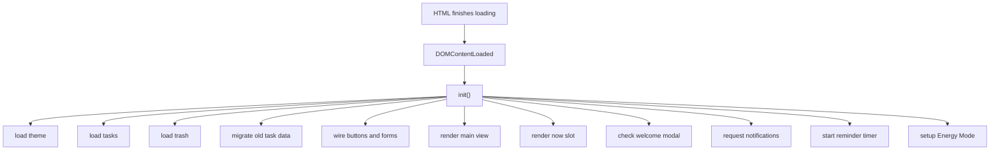

---

## 6. Task Creation Flow

## 6.1 Quick Add Flow

### Code

```javascript
function handleQuickAdd(e) {
    e.preventDefault();
    var input = document.getElementById('quickAddInput');
    var value = input.value.trim();
    if (!value) {
        openNewTaskModal();
        return;
    }

    var parsed = TaskParser.parseNaturalLanguage(value);
    if (!parsed.title) {
        showToast('Missing Title', 'Add a task name before the date, time, or tags');
        return;
    }

    var newTask = addTask({
        title: parsed.title,
        priority: parsed.priority,
        dueDate: parsed.dueDate,
        dueTime: parsed.dueTime,
        tags: parsed.tags,
        recurrence: 'none'
    });

    input.value = '';
    if (!isTaskVisibleInView(newTask, activeView)) {
        setActiveView(getPreferredViewForTask(newTask));
    }
    showToast('Task Added', 'Your task has been created successfully');
}
```

### Line-by-Line

| Code | Plain meaning |
|---|---|
| `function handleQuickAdd(e) {` | make the submit handler for the quick-add form |
| `e.preventDefault();` | stop the browser's normal form reload |
| `var input = document.getElementById('quickAddInput');` | get the quick input box |
| `var value = input.value.trim();` | read typed text and remove extra edge spaces |
| `if (!value) {` | if the user typed nothing |
| `openNewTaskModal();` | open the full task modal instead |
| `return;` | stop the function here |
| `var parsed = TaskParser.parseNaturalLanguage(value);` | ask `taskParser.js` to understand the text |
| `if (!parsed.title) {` | if the parser found no real task title |
| `showToast(...);` | show a helpful message |
| `return;` | stop here |
| `var newTask = addTask({ ... });` | build a task object and save it |
| `input.value = '';` | clear the quick input box |
| `if (!isTaskVisibleInView(newTask, activeView)) {` | if the new task does not belong in the current view |
| `setActiveView(getPreferredViewForTask(newTask));` | switch to a better view such as Today or Upcoming |
| `showToast(...);` | show success feedback |

## 6.2 Core Task Builder

### Code

```javascript
function addTask(taskData) {
    var newTask = {
        id: generateId(),
        title: taskData.title,
        description: taskData.description || '',
        status: 'todo',
        priority: taskData.priority || 'medium',
        dueDate: taskData.dueDate,
        dueTime: taskData.dueTime,
        tags: taskData.tags || [],
        category: taskData.category || '',
        subtasks: taskData.subtasks || [],
        attachments: taskData.attachments || [],
        recurrence: taskData.recurrence || 'none',
        completed: taskData.completed || false,
        pinned: taskData.pinned || false,
        createdAt: new Date(),
        updatedAt: new Date()
    };

    if (taskData.status) {
        newTask.status = taskData.status;
    }

    tasks.push(newTask);
    saveTasks();
    renderView();
    return newTask;
}
```

### Line-by-Line

| Code | Plain meaning |
|---|---|
| `function addTask(taskData) {` | make the reusable task-creation function |
| `var newTask = { ... };` | build one new task object |
| `id: generateId(),` | give it a unique ID |
| `title: taskData.title,` | copy the title in |
| `description: taskData.description || '',` | use description, or empty text if missing |
| `status: 'todo',` | start in the To Do column by default |
| `priority: taskData.priority || 'medium',` | use given priority, or medium |
| `dueDate: taskData.dueDate,` | copy date value |
| `dueTime: taskData.dueTime,` | copy time value |
| `tags: taskData.tags || [],` | use given tags, or empty list |
| `category: taskData.category || '',` | use category or empty text |
| `subtasks: taskData.subtasks || [],` | use given subtasks or empty list |
| `attachments: taskData.attachments || [],` | use given attachments or empty list |
| `recurrence: taskData.recurrence || 'none',` | use recurrence or default to none |
| `completed: taskData.completed || false,` | start as incomplete unless told otherwise |
| `pinned: taskData.pinned || false,` | start unpinned unless told otherwise |
| `createdAt: new Date(),` | save creation time now |
| `updatedAt: new Date()` | save update time now |
| `if (taskData.status) { newTask.status = taskData.status; }` | allow special callers to override default status |
| `tasks.push(newTask);` | add the task to the main array |
| `saveTasks();` | persist tasks through `storage.js` |
| `renderView();` | redraw the UI |
| `return newTask;` | give the created task back to the caller |

## 6.3 Full Modal Creation Flow

### Code

```javascript
function createTaskFromModal() {
    var title = document.getElementById('newTaskTitle').value.trim();
    if (!title) {
        showToast('Missing Title', 'Please enter a task title');
        return;
    }

    var estimateValue = document.getElementById('newTaskEstimate').value;
    var estimateMin;
    if (estimateValue === 'undefined') {
        estimateMin = undefined;
    } else if (estimateValue === 'custom') {
        estimateMin = parseInt(document.getElementById('customEstimateValue').value) || 15;
    } else {
        estimateMin = parseInt(estimateValue) || 15;
    }
    var effort = parseInt(document.getElementById('newTaskEffort').value) || 2;
    var dueDate = document.getElementById('newTaskDate').value;
    var dueTime = document.getElementById('newTaskTime').value;
    var priority = document.getElementById('newTaskPriority').value;
    var tagsStr = document.getElementById('newTaskTags').value;
    var tags = tagsStr ? tagsStr.split(',').map(function(t) { return t.trim(); }).filter(Boolean) : [];
    var description = document.getElementById('newTaskDescription').value.trim();
    var recurrence = document.getElementById('newTaskRepeat').value;
    
    if (recurrence === 'custom') {
        var customValue = parseInt(document.getElementById('customRepeatValue').value) || 1;
        var customUnit = document.getElementById('customRepeatUnit').value;
        recurrence = 'custom:' + customValue + ':' + customUnit;
    }

    var task = {
        id: generateId(),
        title: title,
        description: description,
        status: 'todo',
        priority: priority,
        dueDate: dueDate ? new Date(dueDate + 'T00:00:00') : undefined,
        dueTime: dueTime || undefined,
        tags: tags,
        subtasks: [],
        createdAt: new Date(),
        completed: false,
        pinned: false,
        alarmEnabled: true,
        estimateMin: estimateMin,
        effort: effort,
        activeNow: false,
        recurrence: recurrence
    };

    tasks.unshift(task);
    saveTasks();
    closeNewTaskModal();
    document.getElementById('quickAddInput').value = '';
    renderView();
    showToast('Task Created', '\"' + title + '\" added to your list');
}
```

### What This One Adds Compared to Quick Add

| Quick add | Modal create |
|---|---|
| fast typed input | full form input |
| parser-driven | field-driven |
| smaller task data | more fields like estimate, effort, description, alarm, recurrence |

### Task Creation Flowchart

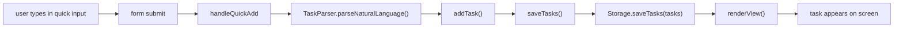

---

## 7. Rendering Logic

### What "Render" Means

Render means:

- take data in JavaScript
- turn it into HTML
- put that HTML into the page

### Main Render Function Code

```javascript
function renderView() {
    var container = document.getElementById('viewContainer');
    var searchResultsHtml = '';
    renderSidebarPriorityPanel();
    
    if (currentSearchQuery && activeView !== 'analytics' && activeView !== 'settings') {
        searchResultsHtml = renderSearchResults();
    }
    
    switch (activeView) {
        case 'today':
            container.innerHTML = searchResultsHtml + renderTodayView();
            break;
        case 'upcoming':
            container.innerHTML = searchResultsHtml + renderUpcomingView();
            break;
        case 'analytics':
            container.innerHTML = renderAnalyticsView();
            break;
        case 'settings':
            container.innerHTML = renderSettingsView();
            break;
        case 'trash':
            container.innerHTML = searchResultsHtml + renderTrashView();
            break;
        case 'board':
        default:
            container.innerHTML = searchResultsHtml + renderBoardView();
    }
    setupViewEventListeners();
    setupSearchResultListeners();
}
```

### Line-by-Line

| Code | Plain meaning |
|---|---|
| `var container = document.getElementById('viewContainer');` | find the main content area |
| `var searchResultsHtml = '';` | start with no search result HTML |
| `renderSidebarPriorityPanel();` | update the sidebar stats first |
| `if (currentSearchQuery && ...) {` | if there is an active search and the current view supports it |
| `searchResultsHtml = renderSearchResults();` | build search result HTML |
| `switch (activeView) {` | choose which main screen to render |
| `case 'today': ...` | show the Today screen |
| `case 'upcoming': ...` | show the Upcoming screen |
| `case 'analytics': ...` | show analytics |
| `case 'settings': ...` | show settings |
| `case 'trash': ...` | show trash |
| `case 'board': default: ...` | otherwise show the board |
| `container.innerHTML = ...` | replace the visible screen content |
| `setupViewEventListeners();` | reattach click handlers to the newly rendered HTML |
| `setupSearchResultListeners();` | reattach search result handlers |

### Render Family

| Render helper | What it builds |
|---|---|
| `renderBoardView()` | 3-column board |
| `renderTodayView()` | tasks due today or overdue |
| `renderUpcomingView()` | future tasks |
| `renderAnalyticsView()` | counts and charts |
| `renderTrashView()` | deleted tasks |
| `renderSettingsView()` | settings and export buttons |
| `renderTaskCard(task)` | one task card |

### Rendering Flow Diagram

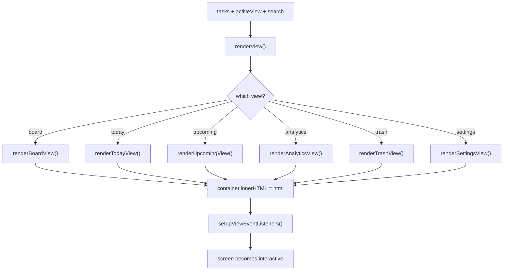

---

## 8. Task Actions

### Action Table

| Action | Real function / block | What it does |
|---|---|---|
| edit | `updateTask()`, `renderTaskModal()`, `startInlineEdit()` | changes task fields |
| delete | `deleteTask()` | removes from main list and moves to trash |
| restore | `restoreTask()` | brings task back from trash |
| permanent delete | `permanentlyDeleteTask()` | removes from trash forever |
| empty trash | `emptyTrash()` | clears all trashed tasks |
| duplicate | `duplicateTask()` | copies an existing task |
| pin | `togglePin()` | marks a task as pinned or not |
| move status | `moveTask()` | moves task to todo / doing / done |
| subtasks | `addSubtask()`, `toggleSubtask()` | manages checklist items |
| bulk actions | `bulkDelete()`, `bulkMove()`, `bulkMarkDone()` | acts on selected tasks |
| snooze | `snoozeTask()` | shifts due date forward |
| recurring | `createTaskFromModal()` + task field | stores repeat rule |
| reminders | `checkAlarms()` | shows due notifications |
| export | button handlers -> `Storage.exportToJSON/CSV()` | downloads task data |
| analytics | `renderAnalyticsView()` | shows summary numbers |
| focus / now | `startNowTask()`, `renderNowSlot()` | marks active tasks |
| Energy Mode | `setupEnergyMode()`, `getEnergyCandidates()` | suggests tasks to work on |

## 8.1 Delete Flow

### Code

```javascript
function deleteTask(id, permanent) {
    var task = tasks.find(function(t) { return t.id === id; });
    if (!task) return;

    lastAction = {
        type: 'delete',
        task: Object.assign({}, task)
    };

    tasks = tasks.filter(function(t) { return t.id !== id; });
    
    if (!permanent) {
        task.deletedAt = new Date();
        trashedTasks.push(task);
        saveTrash();
    }
    
    saveTasks();
    renderView();
    closeTaskModal();
    showUndoToast('Task Deleted', 'The task has been moved to trash');
}
```

### Line-by-Line

| Code | Plain meaning |
|---|---|
| `var task = tasks.find(...)` | find the task to delete |
| `if (!task) return;` | stop if the task does not exist |
| `lastAction = { ... }` | store undo information |
| `tasks = tasks.filter(...)` | remove the task from the main task list |
| `if (!permanent) {` | if this is normal delete, not permanent delete |
| `task.deletedAt = new Date();` | stamp the deletion time |
| `trashedTasks.push(task);` | move the task into the trash list |
| `saveTrash();` | persist trash |
| `saveTasks();` | persist main tasks |
| `renderView();` | redraw the screen |
| `closeTaskModal();` | close the task popup if it was open |
| `showUndoToast(...);` | show undo feedback |

---

## 9. View / Tab System

### Code

```javascript
function setActiveView(view) {
    activeView = view;
    currentTagFilters = [];
    selectedTaskIds.clear();
    isSelectMode = false;
    document.querySelectorAll('.nav-item').forEach(function(item) {
        item.classList.remove('active');
        if (item.getAttribute('data-view') === view) {
            item.classList.add('active');
        }
    });
    renderView();
}
```

### Line-by-Line

| Code | Plain meaning |
|---|---|
| `activeView = view;` | remember the chosen view name |
| `currentTagFilters = [];` | clear tag filters when switching views |
| `selectedTaskIds.clear();` | clear bulk selection |
| `isSelectMode = false;` | leave selection mode |
| `document.querySelectorAll('.nav-item').forEach(...)` | loop through sidebar view buttons |
| `item.classList.remove('active');` | remove current highlight |
| `if (item.getAttribute('data-view') === view) { ... }` | find the clicked matching view button |
| `item.classList.add('active');` | highlight that one |
| `renderView();` | redraw the chosen screen |

### Views in This File

| View name | Main meaning |
|---|---|
| `board` | kanban-style all-task board |
| `today` | due today and overdue |
| `upcoming` | future tasks |
| `analytics` | stats and charts |
| `settings` | settings and exports |
| `trash` | deleted tasks |

### Tab Switching Flowchart

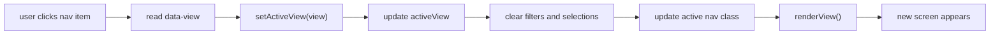

---

## 10. Notifications / Reminder Logic

## 10.1 Reminder Starter

```javascript
function startAlarmChecker() {
    setInterval(checkAlarms, 30000);
    checkAlarms();
    
    document.addEventListener('click', function initAudio() {
        initAudioContext();
        document.removeEventListener('click', initAudio);
    }, { once: true });
}
```

### What It Does

| Line idea | Meaning |
|---|---|
| `setInterval(checkAlarms, 30000);` | run `checkAlarms()` every 30 seconds |
| `checkAlarms();` | also run it once immediately |
| click listener + `initAudioContext()` | prepare sound only after a user interaction |

## 10.2 Main Reminder Checker

### Code

```javascript
function checkAlarms() {
    if (!('Notification' in window) || Notification.permission !== 'granted') return;

    var now = new Date();
    tasks.forEach(function(task) {
        if (task.completed || !task.dueDate || !task.dueTime) return;
        if (task.alarmEnabled === false) return;

        var taskDateTime = new Date(task.dueDate);
        var timeParts = task.dueTime.split(':');
        taskDateTime.setHours(parseInt(timeParts[0]), parseInt(timeParts[1]), 0, 0);

        var diff = taskDateTime.getTime() - now.getTime();
        var notifiedKey = 'notified-' + task.id;

        var fiveMinutes = 5 * 60 * 1000;
        if (diff > 0 && diff <= fiveMinutes && !localStorage.getItem(notifiedKey + '-soon')) {
            showNotificationWithSound(
                'Task Due Soon: ' + task.title,
                'This task is due in about 5 minutes!',
                task.id + '-soon',
                'normal'
            );
            localStorage.setItem(notifiedKey + '-soon', 'true');
        }

        if (diff >= -60000 && diff <= 60000 && !localStorage.getItem(notifiedKey)) {
            showNotificationWithSound(
                'Task Due Now: ' + task.title,
                'This task is due right now!',
                task.id,
                'urgent'
            );
            localStorage.setItem(notifiedKey, 'true');
        }

        if (diff < -60000 && diff > -180000 && !localStorage.getItem(notifiedKey + '-overdue')) {
            showNotificationWithSound(
                'Task Overdue: ' + task.title,
                'This task is now overdue!',
                task.id + '-overdue',
                'urgent'
            );
            localStorage.setItem(notifiedKey + '-overdue', 'true');
        }
    });
}
```

### Line-by-Line

| Code | Plain meaning |
|---|---|
| `if (!('Notification' in window) || Notification.permission !== 'granted') return;` | stop if the browser cannot or may not show notifications |
| `var now = new Date();` | get current time |
| `tasks.forEach(function(task) {` | check each task one by one |
| `if (task.completed || !task.dueDate || !task.dueTime) return;` | skip done tasks or tasks without date/time |
| `if (task.alarmEnabled === false) return;` | skip tasks whose alarm was turned off |
| `var taskDateTime = new Date(task.dueDate);` | start from the task's due date |
| `var timeParts = task.dueTime.split(':');` | split `HH:MM` into hours and minutes |
| `taskDateTime.setHours(...)` | combine the date and time into one real date-time |
| `var diff = taskDateTime.getTime() - now.getTime();` | measure how far away the task is from now |
| `var notifiedKey = 'notified-' + task.id;` | build a unique storage key so the same reminder is not repeated |
| `var fiveMinutes = 5 * 60 * 1000;` | make a 5-minute value in milliseconds |
| first `if (...)` block | show a "due soon" notification |
| second `if (...)` block | show a "due now" notification |
| third `if (...)` block | show an "overdue" notification |
| `localStorage.setItem(...)` | remember that this notification was already shown |

### Reminder Flowchart

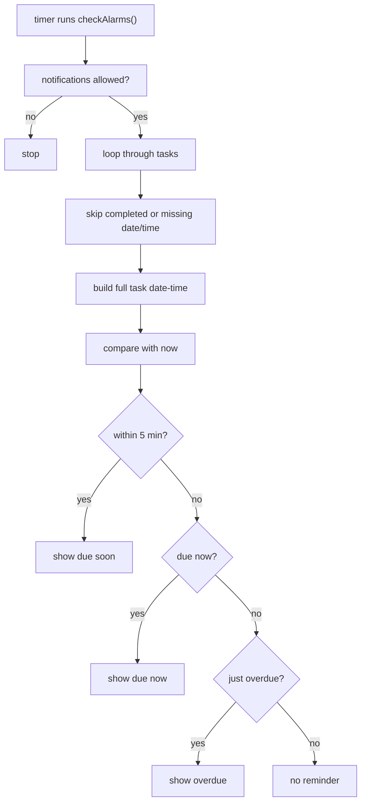

---

## 11. Drag and Drop

### Code

```javascript
function handleDragStart(e, taskId) {
    draggedTaskId = taskId;
    e.dataTransfer.effectAllowed = 'move';
    e.dataTransfer.setData('text/plain', taskId);
    e.target.classList.add('dragging');
}

function handleDrop(e, status) {
    e.preventDefault();
    if (draggedTaskId) {
        moveTask(draggedTaskId, status);
        draggedTaskId = null;
    }
    document.querySelectorAll('.task-card').forEach(function(card) {
        card.classList.remove('dragging');
    });
}
```

### What Happens

| Step | Meaning |
|---|---|
| drag starts | remember which task is being dragged |
| HTML drop target sends column status | board column tells JS which status to move into |
| `moveTask(...)` | updates the task's status |
| rerender | task appears in the new column |

### Drag Flowchart

```mermaid
flowchart LR
    A["user starts dragging task card"] --> B["handleDragStart"]
    B --> C["save draggedTaskId"]
    C --> D["drop on board column"]
    D --> E["handleDrop"]
    E --> F["moveTask(taskId, newStatus)"]
    F --> G["updateTask + saveTasks + renderView"]
```

---

## 12. Energy Mode

## 12.1 What It Is

Energy Mode helps the user choose tasks based on:

- how much time they have
- how much energy they have

## 12.2 Setup Code

```javascript
function setupEnergyMode() {
    var energyBtn = document.getElementById('energyModeBtn');
    var energyModal = document.getElementById('energyModal');
    var energyCloseBtn = document.getElementById('energyCloseBtn');
    var energyModalClose = document.getElementById('energyModalClose');
    var suggestBtn = document.getElementById('suggestTasksBtn');
    var defaultTitle = 'Pick your energy and time — I\\'ll match tasks to your battery level.';

    function resetEnergyModal() {
        var titleEl = document.getElementById('energyModalTitle');
        if (titleEl) titleEl.textContent = defaultTitle;
        document.getElementById('energySuggestions').innerHTML = '';
    }

    if (energyBtn) {
        energyBtn.addEventListener('click', function() {
            resetEnergyModal();
            energyModal.classList.add('show');
        });
    }

    function closeEnergyModal() {
        energyModal.classList.remove('show');
        resetEnergyModal();
    }

    if (suggestBtn) {
        suggestBtn.addEventListener('click', function() {
            var timeBtn = document.querySelector('#timeButtons .energy-option-btn.selected');
            var energyLevelBtn = document.querySelector('#energyButtons .energy-option-btn.selected');
            var time = timeBtn ? parseInt(timeBtn.getAttribute('data-time')) : 30;
            var energy = energyLevelBtn ? parseInt(energyLevelBtn.getAttribute('data-energy')) : 2;
            updateEnergyModalTitle(time, energy);
            showEnergySuggestions(time, energy, false);
        });
    }
}
```

### Line-by-Line

| Code | Plain meaning |
|---|---|
| `var energyBtn = ...` | find the button that opens Energy Mode |
| `var energyModal = ...` | find the popup |
| `var suggestBtn = ...` | find the suggestion button |
| `defaultTitle = ...` | store the starting modal title |
| `resetEnergyModal()` | clear old suggestions and reset title |
| `energyBtn.addEventListener('click', ...)` | open the modal on click |
| `closeEnergyModal()` | hide the modal and clean it up |
| `var timeBtn = document.querySelector(...)` | read selected time choice |
| `var energyLevelBtn = document.querySelector(...)` | read selected energy choice |
| `var time = ...` | turn button data into a number |
| `var energy = ...` | turn button data into a number |
| `updateEnergyModalTitle(...)` | show a matching title |
| `showEnergySuggestions(...)` | build the suggested tasks |

## 12.3 Matching Logic in Simple English

The real scoring logic lives in:

- `getEnergyCandidates(time, energy)`
- `getEnergyMatch(task, time, energy)`

### What It Scores

| Factor | What it means |
|---|---|
| effort | is the task too hard for current energy? |
| estimate | does the task fit the available time? |
| due date | is it urgent soon? |
| priority | is it high priority? |
| status | tasks already in `doing` get some extra score |
| pin | pinned tasks get a small bonus |

### Result Shape

```javascript
{
    tier: number,
    score: number,
    dueSort: number
}
```

### How It Thinks

| Step | Meaning |
|---|---|
| filter | ignore done tasks and already-focused tasks |
| score | calculate urgency, effort match, time match, pin, priority |
| tier | reject tasks that are too mismatched |
| sort | best tasks first |
| slice | keep top suggestions |

### Energy Mode Flowchart

```mermaid
flowchart TD
    A["user picks time + energy"] --> B["showEnergySuggestions()"]
    B --> C["getEnergyCandidates()"]
    C --> D["filter usable tasks"]
    D --> E["getEnergyMatch() for each task"]
    E --> F["score and tier tasks"]
    F --> G["sort best matches first"]
    G --> H["show top suggestions"]
```

---

## 13. How `app.js` Connects to Other JS Files

### Connection Table

| Other file | Real code | Why |
|---|---|---|
| `storage.js` | `Storage.getTasks()` | load saved tasks |
| `storage.js` | `Storage.saveTasks(tasks)` | save every update |
| `storage.js` | `Storage.getTheme()` / `Storage.saveTheme(...)` | remember theme |
| `storage.js` | `Storage.exportToJSON(tasks)` / `Storage.exportToCSV(tasks)` | export files |
| `taskParser.js` | `TaskParser.parseNaturalLanguage(value)` | quick add input |
| `taskParser.js` | `TaskParser.parse(prefillText)` | modal prefill parsing |
| `sampleData.js` | `SampleData.getSampleTasks()` | welcome demo data |

### Sample Data Flow

```javascript
function loadSampleTasks() {
    var samples = SampleData.getSampleTasks();
    samples.forEach(function(taskData) {
        addTask(taskData);
    });
    closeWelcome();
    showToast('Sample Tasks Loaded', 'Added ' + samples.length + ' sample tasks');
}
```

Meaning:

- ask `sampleData.js` for sample task objects
- add them one by one through normal app logic
- close welcome modal
- show success message

---

## 14. Edit Guide

## 14.1 Change Default Tab on Load

At the top of `app.js`, change:

```javascript
var activeView = 'board';
```

Example:

```javascript
var activeView = 'today';
```

Effect:

- the app starts on Today instead of Board

## 14.2 Add a New Field to Every Task

Example field:

`energyNote`

### Step 1: add it in `addTask()`

```javascript
energyNote: taskData.energyNote || '',
```

### Step 2: add it in `createTaskFromModal()`

Read the new input:

```javascript
var energyNote = document.getElementById('newTaskEnergyNote').value.trim();
```

Store it:

```javascript
energyNote: energyNote,
```

### Step 3: show it in the UI

Add output in `renderTaskCard(task)` or `renderTaskModal()`.

Simple example:

```javascript
(task.energyNote ? '<p class="task-energy-note">' + escapeHtml(task.energyNote) + '</p>' : '')
```

### Step 4: outside-file reminder

If the field should also:

- be saved in sample data
- be exported
- be parsed from quick input

then update those other files too.

## 14.3 Add a New Tab / View

You must change **both HTML and JS**.

### In `app.js`

1. make `setActiveView()` accept the new name
2. add a new case in `renderView()`

Example:

```javascript
case 'focus':
    container.innerHTML = renderFocusView();
    break;
```

3. create the render function:

```javascript
function renderFocusView() {
    return '<div>Focus view content here</div>';
}
```

### In `index.html`

Add a nav item with matching `data-view="focus"`.

## 14.4 Modify Energy Logic

Open:

- `getEnergyCandidates(time, energy)`
- `getEnergyMatch(task, time, energy)`

Good places to change:

| What to change | Where |
|---|---|
| how much urgency matters | `dueScore` logic |
| how much priority matters | `priorityScore` line |
| how pinned tasks are favored | `pinScore` line |
| how estimate affects fit | `timeScore` and `estimateBonus` logic |

Example:

```javascript
var priorityScore = (priorityWeight[task.priority] || 2) * 25;
```

This makes priority matter more than before.

## 14.5 Modify Reminder Timing

Open `checkAlarms()`.

Current reminder windows:

| Reminder type | Current condition |
|---|---|
| due soon | within 5 minutes |
| due now | within about 1 minute |
| overdue | between 1 and 3 minutes late |

Example change:

to warn 10 minutes early:

```javascript
var fiveMinutes = 10 * 60 * 1000;
```

If you rename that variable, also rename the label text so it stays clear.

## 14.6 Change Auto-Switch After Quick Add

Open `handleQuickAdd()`.

Current logic:

```javascript
if (!isTaskVisibleInView(newTask, activeView)) {
    setActiveView(getPreferredViewForTask(newTask));
}
```

If you want the app to **never** switch views automatically, remove or comment out that block.

---

## 15. Markmap-Style Outline

- `app.js`
  - role
    - main frontend controller
    - app startup
    - user interaction
    - rendering
  - startup
    - `DOMContentLoaded`
    - `init()`
    - load theme
    - load tasks
    - load trash
    - setup listeners
    - render
  - task creation
    - `handleQuickAdd()`
    - `addTask()`
    - `createTaskFromModal()`
  - task updates
    - `updateTask()`
    - `moveTask()`
    - `deleteTask()`
    - `restoreTask()`
    - `duplicateTask()`
    - `togglePin()`
  - task organization
    - views
    - filters
    - selection mode
    - drag and drop
  - rendering
    - `renderView()`
    - board
    - today
    - upcoming
    - analytics
    - settings
    - trash
    - task card
    - modal
  - reminders
    - permission
    - timer
    - due soon
    - due now
    - overdue
  - Energy Mode
    - open modal
    - choose time
    - choose energy
    - rank tasks
    - show suggestions
  - external links
    - `storage.js`
    - `taskParser.js`
    - `sampleData.js`
    - browser APIs
  - edit guide
    - default tab
    - new task field
    - new view
    - energy logic
    - reminder timing

---

# Phase 8 — `sampleData.js` — Demo Records and Data Shape

## 1. File Purpose

### One-Line Job

`sampleData.js` gives the app ready-made example tasks.

### Why This File Exists

It helps new users:

- see the app with data already inside it
- understand what a task object looks like
- test views like Board, Today, Upcoming, and Analytics

### What This File Does Not Do

It does **not**:

- save data
- render HTML
- parse text
- create task IDs by itself

It only returns sample task objects.

### Big Picture

```mermaid
flowchart LR
    A["sampleData.js"] --> B["app.js loadSampleTasks()"]
    B --> C["addTask(taskData)"]
    C --> D["saveTasks()"]
    D --> E["UI render"]
```

---

## 2. Full Code Listing

```javascript
var SampleData = (function() {
    function getSampleTasks() {
        var now = Date.now();
        var day = 86400000;

        return [
            {
                title: 'Design new landing page',
                description: 'Create mockups for the new product landing page with hero section and features',
                status: 'doing',
                priority: 'high',
                dueDate: new Date(now + day),
                dueTime: '14:00',
                tags: ['design', 'urgent'],
                category: 'Work',
                subtasks: [
                    { id: '1', title: 'Research competitor sites', completed: true },
                    { id: '2', title: 'Create wireframes', completed: true },
                    { id: '3', title: 'Design hero section', completed: false },
                    { id: '4', title: 'Get feedback', completed: false }
                ],
                attachments: [],
                recurrence: 'none',
                completed: false
            },
            {
                title: 'Buy groceries',
                description: 'Milk, eggs, bread, coffee, and vegetables',
                status: 'todo',
                priority: 'medium',
                dueDate: new Date(),
                tags: ['shopping', 'personal'],
                category: 'Personal',
                subtasks: [],
                attachments: [],
                recurrence: 'weekly',
                completed: false
            },
            {
                title: 'Call mom',
                status: 'todo',
                priority: 'high',
                dueDate: new Date(),
                dueTime: '18:00',
                tags: ['family'],
                category: 'Personal',
                subtasks: [],
                attachments: [],
                recurrence: 'none',
                completed: false
            },
            {
                title: 'Review pull requests',
                description: 'Check and approve pending PRs from the team',
                status: 'todo',
                priority: 'medium',
                dueDate: new Date(now + day * 2),
                tags: ['code-review', 'work'],
                category: 'Work',
                subtasks: [],
                attachments: [],
                recurrence: 'daily',
                completed: false
            },
            {
                title: 'Finish quarterly report',
                description: 'Compile data and write summary for Q4 performance',
                status: 'done',
                priority: 'high',
                dueDate: new Date(now - day),
                tags: ['report', 'work'],
                category: 'Work',
                subtasks: [
                    { id: '5', title: 'Gather data', completed: true },
                    { id: '6', title: 'Create charts', completed: true },
                    { id: '7', title: 'Write summary', completed: true },
                    { id: '8', title: 'Submit to manager', completed: true }
                ],
                attachments: [],
                recurrence: 'none',
                completed: true
            },
            {
                title: 'Gym workout',
                description: 'Leg day - squats, lunges, and cardio',
                status: 'done',
                priority: 'low',
                dueDate: new Date(),
                tags: ['fitness', 'health'],
                category: 'Personal',
                subtasks: [],
                attachments: [],
                recurrence: 'daily',
                completed: true
            },
            {
                title: 'Plan weekend trip',
                description: 'Research destinations and book accommodation',
                status: 'todo',
                priority: 'low',
                dueDate: new Date(now + day * 5),
                tags: ['travel', 'fun'],
                category: 'Personal',
                subtasks: [
                    { id: '9', title: 'Choose destination', completed: false },
                    { id: '10', title: 'Book hotel', completed: false },
                    { id: '11', title: 'Plan activities', completed: false }
                ],
                attachments: [],
                recurrence: 'none',
                completed: false
            }
        ];
    }

    return {
        getSampleTasks: getSampleTasks
    };
})();
```

---

## 3. Array-of-Objects Syntax Explained from Zero

### What This File Returns

It returns:

- one array
- filled with many objects
- where each object is one sample task

### Visual

```javascript
[
    { title: 'Task A', priority: 'high' },
    { title: 'Task B', priority: 'low' }
]
```

### Symbol Table

| Symbol | Meaning here |
|---|---|
| `[` `]` | start and end of an array |
| `{` `}` | start and end of one object |
| `:` | field name -> value |
| `,` | separator between fields or items |
| `'text'` | string value |
| `new Date(...)` | create a date object |

### Structure Map

| Level | Example | Meaning |
|---|---|---|
| outer array | `[ ... ]` | list of all sample tasks |
| one task object | `{ title: 'Buy groceries', ... }` | one sample task |
| nested array | `tags: ['shopping', 'personal']` | list inside a task |
| nested object array | `subtasks: [{ id: '1', ... }]` | list of smaller objects inside a task |

### Tiny Mental Model

```mermaid
flowchart TD
    A["sample task list"] --> B["task 1 object"]
    A --> C["task 2 object"]
    B --> D["tags array"]
    B --> E["subtasks array"]
    E --> F["subtask object"]
```

---

## 4. One Sample Task Explained Fully

### Example Task

```javascript
{
    title: 'Design new landing page',
    description: 'Create mockups for the new product landing page with hero section and features',
    status: 'doing',
    priority: 'high',
    dueDate: new Date(now + day),
    dueTime: '14:00',
    tags: ['design', 'urgent'],
    category: 'Work',
    subtasks: [
        { id: '1', title: 'Research competitor sites', completed: true },
        { id: '2', title: 'Create wireframes', completed: true },
        { id: '3', title: 'Design hero section', completed: false },
        { id: '4', title: 'Get feedback', completed: false }
    ],
    attachments: [],
    recurrence: 'none',
    completed: false
}
```

### Field-by-Field Table

| Field | Type | Plain meaning |
|---|---|---|
| `title` | string | main task name |
| `description` | string | longer extra detail |
| `status` | string | which board column it belongs in |
| `priority` | string | urgency level like `high`, `medium`, `low` |
| `dueDate` | `Date` | the due day |
| `dueTime` | string | due clock time |
| `tags` | array of strings | labels used for filtering and display |
| `category` | string | broad grouping like Work or Personal |
| `subtasks` | array of objects | checklist items inside the task |
| `attachments` | array | extra attached items, empty here |
| `recurrence` | string | repeat rule like `daily`, `weekly`, or `none` |
| `completed` | boolean | whether the whole task is done |

### Repo-Truth Note

The prompt example mentioned fields like:

- `id`
- `pinned`
- `reminder`

But the real sample objects in this file do **not** include those top-level fields.

Those get added later by normal app logic in `app.js`, especially in `addTask()`.

### About `id`

Inside `sampleData.js`:

- main tasks do **not** have top-level IDs
- subtasks **do** have their own small IDs

When sample tasks are loaded, `app.js` adds the main task ID.

---

## 5. How `app.js` Uses This File

### Real Loader Code

```javascript
function loadSampleTasks() {
    var samples = SampleData.getSampleTasks();
    samples.forEach(function(taskData) {
        addTask(taskData);
    });
    closeWelcome();
    showToast('Sample Tasks Loaded', 'Added ' + samples.length + ' sample tasks');
}
```

### Step-by-Step Table

| Step | What happens |
|---|---|
| 1 | user clicks the sample-data button |
| 2 | `loadSampleTasks()` runs |
| 3 | `SampleData.getSampleTasks()` returns the array from `sampleData.js` |
| 4 | `samples.forEach(...)` loops over each sample task |
| 5 | `addTask(taskData)` sends each sample through the normal task creation path |
| 6 | `addTask(...)` adds extra app fields like ID and timestamps |
| 7 | tasks are saved |
| 8 | welcome modal closes |
| 9 | success toast appears |

### Why This Is Good Design

The app does **not** special-case sample tasks too much.

Instead, it reuses the normal task-creation function.

That means sample tasks become normal tasks.

---

## 6. Mermaid Diagram

```mermaid
flowchart LR
    A["sampleData.js"] --> B["SampleData.getSampleTasks()"]
    B --> C["app.js loadSampleTasks()"]
    C --> D["forEach(taskData)"]
    D --> E["addTask(taskData)"]
    E --> F["saveTasks()"]
    F --> G["Storage.saveTasks(tasks)"]
    G --> H["renderView() / visible tasks"]
```

---

## 7. Edit Guide

## 7.1 Add a New Sample Task

Add one more object inside the returned array.

Example:

```javascript
{
    title: 'Read design notes',
    description: 'Go through the latest notes before tomorrow',
    status: 'todo',
    priority: 'medium',
    dueDate: new Date(now + day),
    tags: ['study', 'design'],
    category: 'Personal',
    subtasks: [],
    attachments: [],
    recurrence: 'none',
    completed: false
}
```

Put a comma after the previous object if needed.

## 7.2 Avoid Syntax Mistakes

### Safe Checklist

| Rule | Why |
|---|---|
| keep commas between objects | array items must be separated |
| keep commas between fields | object fields must be separated |
| match every `{` with `}` | each task object must close properly |
| match every `[` with `]` | the task list and nested arrays must close properly |
| keep quotes around text | strings must be text values |
| use `new Date(...)` for date examples | keeps date fields in the right type |

## 7.3 Keep Object Shape Consistent

Try to keep the same main fields across sample tasks:

- `title`
- `status`
- `priority`
- `dueDate`
- `tags`
- `category`
- `subtasks`
- `attachments`
- `recurrence`
- `completed`

Some fields can be missing, like:

- `description`
- `dueTime`

But the shape should stay mostly similar so the app UI stays predictable.

## 7.4 If You Want Pinned Sample Tasks

Because `addTask()` supports `pinned`, you can add:

```javascript
pinned: true
```

to a sample task object.

The same idea works for fields like:

- `estimateMin`
- `effort`
- `alarmEnabled`

as long as `app.js` already supports them.

---

## 8. Markmap-Style Outline

- `sampleData.js`
  - role
    - provide demo tasks
    - help first-time users
    - show data shape
  - structure
    - IIFE wrapper
    - `getSampleTasks()`
    - return array of task objects
  - concepts
    - array of objects
    - nested arrays
    - subtask objects
    - `new Date(...)`
  - task fields
    - title
    - description
    - status
    - priority
    - dueDate
    - dueTime
    - tags
    - category
    - subtasks
    - attachments
    - recurrence
    - completed
  - app connection
    - `SampleData.getSampleTasks()`
    - `loadSampleTasks()`
    - `addTask(taskData)`
  - edit guide
    - add sample task
    - avoid comma / bracket mistakes
    - keep object shape consistent

---

# Phase 9 — `index.html` — The UI Skeleton

## 1. File Purpose

### One-Line Job

`index.html` is the main page structure of the app.

### Why It Is Called the "Skeleton"

HTML gives the app:

- page sections
- buttons
- inputs
- containers
- modals

It does **not** decide:

- colors
- spacing
- animations
- task logic

Those come later from CSS and JavaScript.

### Big Picture

```mermaid
flowchart LR
    A["index.html"] --> B["page structure"]
    B --> C["CSS styles it"]
    B --> D["JavaScript makes it interactive"]
    D --> E["task app UI"]
```

---

## 2. Code Listing in Logical Blocks

### Why It Is Split Into Blocks

The file is long, so this guide shows it in major sections instead of one giant unreadable wall.

## 2.1 Document Start, `<head>`, and CSS Link

```html
<!DOCTYPE html>
<html lang="en">
<head>
    <meta charset="UTF-8">
    <meta name="viewport" content="width=device-width, initial-scale=1.0">
    <title>Oops, Later! - Task Manager</title>
    <link rel="preconnect" href="https://fonts.googleapis.com">
    <link rel="preconnect" href="https://fonts.gstatic.com" crossorigin>
    <link href="https://fonts.googleapis.com/css2?family=Syne:wght@400;700;800&family=Space+Grotesk:wght@400;500;600;700&family=JetBrains+Mono:wght@400;500&display=swap" rel="stylesheet">
    <link rel="stylesheet" href="css/styles.css">
</head>
```

### What This Part Does

| Line / tag | Plain meaning |
|---|---|
| `<!DOCTYPE html>` | tells the browser this is a modern HTML5 page |
| `<html lang="en">` | starts the HTML document and says the language is English |
| `<head>` | hidden setup area for the page |
| `<meta charset="UTF-8">` | allows normal text characters to work correctly |
| `<meta name="viewport" ...>` | helps the page size correctly on phones and smaller screens |
| `<title>...</title>` | sets the browser tab title |
| Google font `<link>` tags | load the fonts used by the design |
| `<link rel="stylesheet" href="css/styles.css">` | connects the page to `styles.css` |

## 2.2 Main App Layout

```html
<body>
    <div id="app" class="app-container">
        <aside class="sidebar" id="sidebar">
            ...
        </aside>

        <main class="main-content">
            <div class="content-wrapper">
                <div id="nowSlotContainer"></div>

                <div class="energy-mode-header">
                    <button class="btn btn-energy" id="energyModeBtn">Energy Mode ⚡</button>
                </div>

                <div class="quick-add-bar" id="quickAddBar">
                    <form class="quick-add-container" id="quickAddForm">
                        <input 
                            type="text" 
                            id="quickAddInput" 
                            class="quick-add-input" 
                            placeholder="Add a task... (e.g. &quot;Meeting tomorrow 3pm #work&quot;)"
                        >
                        <button type="submit" class="quick-add-button add-btn" id="addTaskBtn" title="Add new task">
                            ...
                        </button>
                    </form>
                    <p class="quick-add-hint">Press Enter to add task, N to open form, / to search. Try: "Walk tomorrow 3pm high priority #urgent"</p>
                </div>

                <div id="viewContainer"></div>
            </div>
        </main>
    </div>
```

### What This Part Does

| Element | Job |
|---|---|
| `#app` | outer wrapper for the whole app |
| `.sidebar` | left navigation area |
| `.main-content` | main right-side content area |
| `#nowSlotContainer` | focus / active-now area inserted by JS |
| `#energyModeBtn` | opens Energy Mode |
| `#quickAddForm` | quick-add task form |
| `#quickAddInput` | main typing box |
| `#viewContainer` | empty container where JS renders Board, Today, Upcoming, etc. |

## 2.3 Sidebar Navigation

```html
<nav class="sidebar-nav">
    <ul class="nav-list">
        <li><button class="nav-item" data-view="today">...</button></li>
        <li><button class="nav-item" data-view="upcoming">...</button></li>
        <li><button class="nav-item active" data-view="board">...</button></li>
        <li><button class="nav-item" data-view="analytics">...</button></li>
        <li><button class="nav-item" data-view="trash">...</button></li>
        <li><button class="nav-item" data-view="settings">...</button></li>
    </ul>

    <div class="sidebar-priority-panel" id="sidebarPriorityPanel"></div>
</nav>
```

### What This Part Does

| Item | Meaning |
|---|---|
| `.nav-item` | one sidebar button |
| `data-view="today"` | tells JS which screen to switch to |
| `.active` | marks the currently selected view |
| `#sidebarPriorityPanel` | empty area filled later by JS with priority info |

## 2.4 Popups / Overlays

### Main popup IDs in this file

| Popup | ID |
|---|---|
| task details modal | `taskModal` |
| welcome modal | `welcomeModal` |
| global search overlay | `globalSearchOverlay` |
| new task modal | `newTaskModal` |
| Energy Mode modal | `energyModal` |

## 2.5 Script Loading

```html
<script src="js/storage.js"></script>
<script src="js/taskParser.js"></script>
<script src="js/sampleData.js"></script>
<script src="js/app.js"></script>
</body>
</html>
```

### Why Order Matters

| Script | Why it loads before the next one |
|---|---|
| `storage.js` | `app.js` uses `Storage` |
| `taskParser.js` | `app.js` uses `TaskParser` |
| `sampleData.js` | `app.js` uses `SampleData` |
| `app.js` | main controller loads last so the helpers already exist |

---

## 3. HTML Basics Explained Using This File

### Basic Terms

| Term | Simple meaning | Example |
|---|---|---|
| tag | HTML building block | `<div>` |
| opening tag | starts an element | `<button>` |
| closing tag | ends an element | `</button>` |
| attribute | extra information on a tag | `id="viewContainer"` |
| text content | text inside a tag | `Dark Mode` |

### Common Tags in This File

| Tag | What it is used for here |
|---|---|
| `<div>` | general box / section |
| `<aside>` | sidebar area |
| `<main>` | main app content |
| `<nav>` | navigation area |
| `<ul>` / `<li>` | list of nav items or guide steps |
| `<button>` | clickable controls |
| `<input>` | typing fields |
| `<textarea>` | larger text box |
| `<select>` / `<option>` | dropdown choices |
| `<h1>`, `<h2>` | headings |
| `<p>` | paragraph text |
| `<label>` | text label for a form field |
| `<svg>` | vector icons |
| `<form>` | input group that can be submitted |

### Important Attributes in This File

| Attribute | Meaning | Example |
|---|---|---|
| `class="..."` | styling / grouping name | `class="nav-item"` |
| `id="..."` | unique name for JS or CSS targeting | `id="quickAddInput"` |
| `type="..."` | what kind of input/button | `type="text"` |
| `placeholder="..."` | hint shown inside an empty input | `placeholder="Search tasks..."` |
| `data-view="..."` | custom extra data used by JS | `data-view="today"` |
| `for="..."` | connects a label to an input | `label for="newTaskTitle"` |

---

## 4. How `class`, `id`, and `onclick` Connect Things

## 4.1 `class=` connects HTML to CSS

Example:

```html
<button class="nav-item active" data-view="board">
```

Meaning:

- `nav-item` lets CSS style all nav buttons
- `active` lets CSS highlight the selected one

## 4.2 `id=` connects HTML to JS

Example:

```html
<input type="text" id="quickAddInput" class="quick-add-input">
```

Then JS can find it with:

```javascript
document.getElementById('quickAddInput')
```

## 4.3 `onclick=` bridge note

### Repo-Truth Note

This static `index.html` file does **not** use inline `onclick="..."` attributes.

Instead, this project mostly uses:

```javascript
addEventListener(...)
```

inside `app.js`.

### But the idea still matters

`onclick="someFunction()"` would mean:

- HTML directly calls a JS function on click

This repo uses that pattern mostly in **generated HTML from `app.js`** for drag events like:

- `ondragstart="App.handleDragStart(...)" `
- `ondrop="App.handleDrop(...)" `

So the bridge idea is still part of the full project, just not mainly inside static `index.html`.

### Quick Comparison

| Pattern | Used in static `index.html`? | Used in project overall? |
|---|---|---|
| `onclick="..."` | no | mostly no |
| `addEventListener(...)` | yes, through JS | yes |
| inline drag event attributes | no in static file | yes in HTML strings built by `app.js` |

---

## 5. Structural Map of the File

### Major Blocks

| Block | Main purpose |
|---|---|
| sidebar | app title, navigation, theme toggle |
| quick input area | fast task creation |
| main content container | where JS renders active view content |
| task modal | view/edit one task |
| welcome modal | onboarding and sample tasks |
| global search overlay | search popup |
| new task modal | full task form |
| Energy Mode modal | time + energy based suggestions |
| toast container | temporary feedback messages |

### Layout Tree Diagram

```mermaid
flowchart TD
    A["body"] --> B["#app.app-container"]
    B --> C["aside.sidebar"]
    B --> D["main.main-content"]
    C --> C1["sidebar header"]
    C --> C2["sidebar nav"]
    C2 --> C21["Today"]
    C2 --> C22["Upcoming"]
    C2 --> C23["Board"]
    C2 --> C24["Analytics"]
    C2 --> C25["Trash"]
    C2 --> C26["Settings"]
    C --> C3["theme toggle"]
    D --> D1["#nowSlotContainer"]
    D --> D2["Energy Mode button"]
    D --> D3["quick add form"]
    D --> D4["#viewContainer"]
    A --> E["#taskModal"]
    A --> F["#welcomeModal"]
    A --> G["#globalSearchOverlay"]
    A --> H["#newTaskModal"]
    A --> I["#energyModal"]
    A --> J["#toastContainer"]
```

---

## 6. How HTML Connects to CSS

### Simple Rule

CSS looks at selectors and finds matching HTML.

Example:

| HTML | CSS target idea |
|---|---|
| `<aside class="sidebar" id="sidebar">` | `.sidebar` |
| `<button class="nav-item active">` | `.nav-item` and `.nav-item.active` |
| `<div class="modal-overlay" id="taskModal">` | `.modal-overlay` |
| `<input class="form-input">` | `.form-input` |

### Why Repeated Class Names Matter

Many elements use the same class so CSS can style them together.

Examples:

- all modal close buttons use `class="modal-close"`
- many buttons use `class="btn"`
- many form fields use `class="form-input"` or `class="form-select"`

That avoids repeating styling rules one by one.

---

## 7. How HTML Connects to JS

### Main IDs Used by `app.js`

| ID | JS reason |
|---|---|
| `themeToggle` | dark/light mode button |
| `quickAddForm` | quick-add submit handler |
| `quickAddInput` | read typed task text |
| `viewContainer` | inject active screen HTML |
| `taskModal` | show/hide task detail popup |
| `modalBody` | fill task modal content |
| `welcomeModal` | onboarding popup |
| `loadSamplesBtn` | load demo tasks |
| `startFreshBtn` | close welcome and start empty |
| `globalSearchInput` | search field |
| `globalSearchResults` | search results area |
| `newTaskModal` | full task form popup |
| `createTaskBtn` | create task from modal |
| `energyModeBtn` | open Energy Mode |
| `suggestTasksBtn` | generate energy-based suggestions |
| `energySuggestions` | fill suggestion results |

### `data-*` Attributes

This file also uses custom data values like:

```html
<button class="nav-item" data-view="today">
```

Meaning:

- visible text says `Today`
- hidden extra data says `today`
- JS reads that value to decide which screen to render

---

## 8. Modals / Popups Explained

### What a Modal Is

A modal is a popup layer shown on top of the main page.

### Basic Modal Pattern in This Project

```html
<div class="modal-overlay" id="taskModal">
    <div class="modal-content" id="modalContent">
        ...
    </div>
</div>
```

### How It Works

| Part | Meaning |
|---|---|
| outer overlay | full-screen background layer |
| inner content box | actual popup panel |
| close button | user closes the popup |
| JS class change | popup becomes visible or hidden |

### Show/Hide Idea

The pattern is:

- CSS hides overlay by default
- JS adds a class like `show`
- CSS then displays it visibly

### Example from the project

JS does things like:

```javascript
document.getElementById('taskModal').classList.add('show');
document.getElementById('taskModal').classList.remove('show');
```

### Modal Flow Diagram

```mermaid
flowchart LR
    A["modal HTML exists in page"] --> B["CSS hides it by default"]
    B --> C["user clicks button"]
    C --> D["JS adds .show"]
    D --> E["modal becomes visible"]
    E --> F["user closes it"]
    F --> G["JS removes .show"]
    G --> H["modal hidden again"]
```

---

## 9. Markmap-Style Hierarchy

- `index.html`
  - document setup
    - doctype
    - html
    - head
    - title
    - fonts
    - stylesheet link
  - app layout
    - `#app`
    - sidebar
      - logo
      - tagline
      - nav buttons
      - priority panel
      - theme toggle
    - main content
      - now slot container
      - energy mode button
      - quick add form
      - view container
  - overlays and popups
    - task modal
    - welcome modal
    - global search overlay
    - new task modal
    - Energy Mode modal
    - toast container
  - HTML concepts
    - tags
    - attributes
    - class
    - id
    - data attributes
    - form fields
  - CSS connection
    - classes
    - repeated selector groups
  - JS connection
    - ids
    - data-view
    - addEventListener
    - show / hide classes

---

## 10. Edit Guide

## 10.1 Add a New Button

Example:

add a button inside the sidebar.

```html
<button class="nav-item" id="focusModeBtn">
    <span>Focus</span>
</button>
```

Then decide:

- should CSS style it using existing classes?
- should JS attach a click handler to `focusModeBtn`?

## 10.2 Add a New Input

Example:

add one field to the new-task modal.

```html
<div class="form-group">
    <label for="newTaskEnergyNote">Energy Note</label>
    <input type="text" id="newTaskEnergyNote" class="form-input" placeholder="Low effort, deep work, etc.">
</div>
```

Then update `app.js` to read:

- `document.getElementById('newTaskEnergyNote').value`

## 10.3 Add a New Tab Section

### In `index.html`

Add another nav button:

```html
<button class="nav-item" data-view="focus">
    <span>Focus</span>
</button>
```

### In `app.js`

Also add matching view logic in `setActiveView()` / `renderView()`.

The `data-view` value and the JS view name must match.

## 10.4 Add a New Modal

Basic pattern:

```html
<div class="modal-overlay" id="focusModal">
    <div class="modal-content">
        <button class="modal-close" id="focusModalClose">X</button>
        <h2>Focus Mode</h2>
    </div>
</div>
```

Then in JS:

- open it with `.classList.add('show')`
- close it with `.classList.remove('show')`

## 10.5 Safely Name IDs and Classes

### Good rules

| Rule | Why |
|---|---|
| IDs should be unique | JS expects one exact element |
| classes can repeat | CSS often styles groups |
| use descriptive names | easier to understand later |
| keep `data-view` values simple | they must match JS view names |

### Good examples

| Good name | Why |
|---|---|
| `newTaskEnergyNote` | clearly says what it is |
| `focusModal` | clearly says which popup it is |
| `task-card-meta` | clearly says which visual part it styles |

---

# Phase 10 — `styles.css` — Visual Design, Dark Mode, Responsiveness

## 1. File Purpose

### One-Line Job

`styles.css` controls how the app looks.

### What CSS Changes

| CSS controls | Example in this project |
|---|---|
| colors | neon pink, cyan, lime, cream, dark backgrounds |
| layout | sidebar + main area, board columns, modals |
| spacing | padding, gaps, margins |
| size | card height, input height, text sizes |
| interaction feel | hover movement, shadows, active states |
| responsiveness | desktop vs tablet vs mobile layout |

### What CSS Does Not Do

It does not:

- save tasks
- create task objects
- parse typed text
- handle reminders

That is JavaScript work.

---

## 2. CSS Syntax From Zero

### Basic Pattern

```css
selector {
    property: value;
}
```

### Meaning

| Part | Plain meaning |
|---|---|
| selector | which HTML element(s) to target |
| property | what visual thing to change |
| value | what to change it to |

### Tiny Example

```css
.nav-item {
    background: var(--card);
    border: 3px solid #000;
}
```

Meaning:

- target all elements with class `nav-item`
- give them the card color
- give them a black border

### Common Selector Types in This File

| Selector type | Example | Meaning |
|---|---|---|
| class selector | `.sidebar` | target elements with that class |
| ID selector | `#app` | target one unique element |
| type selector | `body` | target all tags of that type |
| descendant selector | `.dark .sidebar` | target `.sidebar` only inside `.dark` |
| attribute selector | `.task-column[data-status="todo"] .column-header` | target a column header only for todo columns |
| pseudo-like state selector | `.nav-item:hover` | target while the mouse is over it |

### Common CSS Values Here

| Value type | Example |
|---|---|
| color | `#ff006e` |
| CSS variable | `var(--card)` |
| size | `24px` |
| flexible size | `clamp(16px, 1vw + 4px, 22px)` |
| layout mode | `display: flex` / `display: grid` |
| hidden / shown | `display: none` / `display: flex` |

---

## 3. CSS Variables

## 3.1 What `:root` Means

` :root ` is the top-level place where global CSS variables are stored.

In this file:

```css
:root {
    --background: #f2ecdf;
    --foreground: hsl(0, 0%, 0%);
    --card: #fffdf8;
    --neon-pink: #ff006e;
    --neon-cyan: #00f5ff;
    --neon-lime: #ccff00;
}
```

### What `--name` Means

Example:

```css
--background: #f2ecdf;
```

Meaning:

- make a reusable variable called `background`
- store this color in it

### What `var(--background)` Means

Example:

```css
body {
    background-color: var(--background);
}
```

Meaning:

- get the current value of `--background`
- use it here

### Why Variables Help

| Benefit | Why it matters |
|---|---|
| reuse | same color can be used in many places |
| easy theme changes | change one variable, many places update |
| cleaner file | avoids repeating the same raw color codes |

## 3.2 Variable Families in This File

| Variable group | Examples | Job |
|---|---|---|
| base colors | `--background`, `--foreground`, `--card` | main app colors |
| accent colors | `--neon-pink`, `--neon-cyan`, `--neon-lime` | bright highlights |
| shadow variables | `--shadow-brutal`, `--shadow-accent-pink` | consistent comic/brutalist shadows |
| fonts | `--font-display`, `--font-body`, `--font-mono` | typography system |
| desktop sizing | `--desktop-sidebar-width`, `--desktop-input-height` | responsive sizing |

### Retheme Example

If you change:

```css
--neon-pink: #ff006e;
```

to:

```css
--neon-pink: #ff7a00;
```

then many pink parts change together:

- active nav item
- pink priority styles
- quick-add button
- highlights and badges

---

## 4. Dark Mode

## 4.1 Repo-Truth Note

This project uses:

```css
.dark
```

not:

```css
.dark-mode
```

## 4.2 How It Works

The JS file toggles the `dark` class on the root document.

Then CSS rules like these activate:

```css
.dark {
    --background: #141414;
    --foreground: #fffaf0;
    --card: #202020;
}
```

and:

```css
.dark .sidebar { ... }
.dark .task-card { ... }
.dark .nav-item.active { ... }
```

### Dark Mode Layers

| Layer | What changes |
|---|---|
| variables | base colors and shadows change first |
| component overrides | sidebar, cards, buttons, dropdowns get new colors |
| icon swap | moon hides, sun shows |
| special accents | dark mode uses neon colors differently for contrast |

### Simple Mental Model

```mermaid
flowchart LR
    A["JS adds .dark"] --> B["dark variables replace root variables"]
    B --> C["component selectors like .dark .sidebar apply"]
    C --> D["browser paints dark UI"]
```

---

## 5. Layout System

### Main Layout Tools Used Here

| Tool | Where | Why |
|---|---|---|
| `display: flex` | app shell, sidebar areas, buttons, modal rows | line items up in rows or columns |
| `display: grid` | board columns, stats grid, form rows | place items in clean columns |
| `position: sticky` | sidebar | keeps sidebar visible on desktop |
| `position: fixed` | overlays, noise layer | floats over the page |
| `gap` | many containers | spacing between items |
| `clamp(...)` | desktop sizing variables | makes sizes scale smoothly |

### Core Layout Examples

| Selector | Main layout rule |
|---|---|
| `.app-container` | `display: flex` |
| `.sidebar` | fixed-width column on desktop |
| `.main-content` | flexible main area |
| `.board-container` | 3-column grid on desktop |
| `.form-row` | 2-column grid |
| `.modal-overlay.show` | `display: flex` to center popups |

---

## 6. Visual Identity

### Design Direction

This CSS is not plain/minimal.

It uses:

- bright neon accents
- thick black borders
- sharp block shadows
- expressive fonts
- comic/brutalist style movement

### Important Visual Patterns

| Pattern | Example |
|---|---|
| heavy black borders | cards, buttons, modals, columns |
| offset shadow look | `box-shadow: var(--shadow-brutal)` |
| neon color coding | pink = high / active, cyan = medium / focus, lime = success / low |
| hover movement | many buttons move with `transform` |
| patterned background | page grid + subtle noise |

### Animations Used

| Animation | Where | Effect |
|---|---|---|
| `bounceIn` | `.task-card` | cards pop in with a quick bounce |
| `slideIn` | `.toast` | toasts slide into view |
| `pinWiggle` | pinned task chip | tiny wiggle effect on hover |

---

## 7. Responsive Design

### What `@media` Means

`@media` means:

- only apply these CSS rules when the screen matches a condition

Example:

```css
@media (max-width: 720px) {
    .task-card {
        padding: 18px 16px 16px 20px;
    }
}
```

Meaning:

- when the screen is 720px wide or smaller
- use this smaller mobile-friendly style

### Real Breakpoints in This File

| Breakpoint | Meaning |
|---|---|
| `@media (min-width: 640px)` | adjust welcome actions for wider screens |
| `@media (min-width: 768px)` | larger grid layouts like stats/shortcuts |
| `@media (min-width: 1024px)` | wider analytics grids |
| `@media (min-width: 1101px)` | desktop mode |
| `@media (min-width: 1101px) and (max-height: 860px)` | shorter desktop screens |
| `@media (max-width: 1100px)` | tablet / smaller laptop layout |
| `@media (max-width: 720px)` | phone layout |

### What Changes on Smaller Screens

| Screen size | Main layout change |
|---|---|
| desktop | sidebar on left, board as grid |
| <= 1100px | sidebar moves to top, board becomes horizontal scroll columns |
| <= 720px | tighter spacing, stacked buttons, smaller text/layout pieces |

---

## 8. Top Important Selectors Table

| Selector | What it targets | Visual effect | Related HTML section |
|---|---|---|---|
| `:root` | whole document | stores global variables | entire app |
| `.dark` | app in dark mode | swaps variables and overrides component colors | entire app |
| `body` | full page | background color, grid background, text color | whole page |
| `.app-container` | main shell | flex layout for sidebar + content | root app wrapper |
| `.sidebar` | left panel | fixed/sticky panel with border and background | sidebar |
| `.nav-item` | sidebar buttons | bordered blocks with hover movement | navigation |
| `.nav-item.active` | current view button | bright active highlight | navigation |
| `.theme-toggle` | theme button | lime button style | sidebar footer |
| `.quick-add-input` | main task input | large bold input field | quick add bar |
| `.quick-add-button` | plus button | pink action button | quick add bar |
| `.board-container` | board area | 3-column grid or scrolling columns | board view |
| `.column-header` | column top bars | strong section cards with accent corner | board columns |
| `.task-card` | task item cards | bordered cards with shadow and hover lift | task list |
| `.badge` | small metadata labels | compact bordered chips | task cards and modal |
| `.modal-overlay` | popup background layer | hidden full-screen overlay | all modals |
| `.modal-overlay.show` | visible modal state | turns modal overlay on with flex | all modals |
| `.btn` | generic button base | reusable button styling | many sections |
| `.global-search-overlay` | search popup layer | dark background blur overlay | global search |
| `.energy-modal-content` | Energy Mode panel | special modal panel styling | Energy Mode |
| `.new-task-modal-content` | New Task panel | structured form popup styling | new task modal |

---

## 9. CSS Architecture by Section

### Main Sections in the File

| CSS area | What it styles |
|---|---|
| variables + dark mode | color system and theme switching |
| reset | margin/padding/box model cleanup |
| shell | body, app container, sidebar, main content |
| navigation | logo, nav items, theme toggle |
| quick add | input bar, hint, add button |
| board | columns, headers, task cards |
| task details | dropdowns, badges, modal content |
| welcome | intro popup |
| analytics/settings | cards, charts, stats, settings sections |
| toast/search | feedback popups and search overlay |
| Energy Mode + new task modal | suggestion UI and task form |
| responsive rules | desktop/tablet/mobile adjustments |

---

## 10. Mermaid Diagram

```mermaid
flowchart LR
    A["HTML element<br/>example: <button class='nav-item active'>"] --> B["CSS selector match<br/>.nav-item and .nav-item.active"]
    B --> C["variables resolved<br/>var(--card), var(--neon-pink)"]
    C --> D["properties applied<br/>background, border, shadow, color"]
    D --> E["browser paints final button"]
```

---

## 11. Edit Guide

## 11.1 Change Primary Accent Color

This app uses several accent colors, but pink is one of the main ones.

Change in `:root`:

```css
--neon-pink: #ff006e;
```

Example:

```css
--neon-pink: #ff7a00;
```

Also check `.dark` if you want the dark-mode shadow version to match:

```css
--shadow-pink-color: rgba(255, 0, 110, 0.78);
```

## 11.2 Change Dark Mode Colors

Open:

```css
.dark {
    --background: #141414;
    --foreground: #fffaf0;
    --card: #202020;
}
```

Change those variable values.

That is the safest place because many dark selectors reuse those variables.

## 11.3 Change Card Styling

Open:

```css
.task-card {
    background-color: var(--card);
    border: 3px solid #000;
    ...
}
```

Good things to tweak:

| Property | Effect |
|---|---|
| `border` | thicker or thinner card outline |
| `box-shadow` | stronger or softer card depth |
| `padding` | more or less inner space |
| `background-color` / `background-image` | flatter or brighter look |

## 11.4 Adjust Spacing

Common places:

| Selector | Spacing property |
|---|---|
| `.content-wrapper` | `gap` |
| `.board-container` | `gap`, `padding` |
| `.task-list` | `gap` |
| `.main-content` | `padding` |
| `.task-card` | `padding` |

## 11.5 Add a New Animation

Pattern:

```css
@keyframes glowPop {
    0% { transform: scale(0.98); }
    100% { transform: scale(1); }
}
```

Then apply it:

```css
.my-new-element {
    animation: glowPop 0.2s ease;
}
```

## 11.6 Tweak Mobile Responsiveness

Open the smaller-screen blocks:

```css
@media (max-width: 1100px) { ... }
@media (max-width: 720px) { ... }
```

That is where you change:

- stacked vs side-by-side layout
- mobile card sizes
- button widths
- form row layout

### Example: make mobile quick input slightly smaller

Inside `@media (max-width: 720px)`:

```css
.quick-add-input {
    font-size: 1.05rem;
}
```

instead of:

```css
.quick-add-input {
    font-size: 1.15rem;
}
```

---

## 12. Markmap-Style Outline

- `styles.css`
  - role
    - controls visuals
    - no task logic
  - CSS basics
    - selector
    - property
    - value
    - classes
    - IDs
    - descendants
    - attributes
  - variables
    - `:root`
    - colors
    - shadows
    - fonts
    - desktop sizing
  - dark mode
    - `.dark`
    - variable overrides
    - component overrides
  - layout
    - flex
    - grid
    - sticky sidebar
    - fixed overlays
  - visual identity
    - neon accents
    - brutal shadows
    - borders
    - expressive fonts
  - responsive design
    - desktop
    - tablet
    - mobile
    - media queries
  - key selectors
    - sidebar
    - nav item
    - quick add input
    - board container
    - task card
    - modal overlay
    - buttons
  - edit guide
    - change accent
    - change dark mode
    - change cards
    - adjust spacing
    - add animation
    - tweak mobile

---

# Phase 11 — Supporting Files and Project Configuration

## 1. Why These Files Matter

These files do not build the visible task UI directly.

But they still matter because they explain:

- what the project is
- which Python packages it may need
- how the Python environment is described

### Files Covered

| File | Main job |
|---|---|
| `README.md` | human-readable project guide |
| `requirements.txt` | simple Python dependency list |
| `pyproject.toml` | modern Python project metadata and dependency file |

---

## 2. `README.md`

## 2.1 Purpose of a README

A README is usually the first file a human reads in a project.

It answers questions like:

- What is this project?
- What features does it have?
- How do I run it?
- What files are inside it?

## 2.2 What This README Communicates

### Main things it includes

| Section in README | What it tells the reader |
|---|---|
| title + tagline | project name and style |
| feature list | what the app can do |
| architecture diagrams | how files and flows connect |
| getting started | how to run it |
| project structure | what files exist |
| design system | colors, fonts, shadows |
| FAQ | common beginner questions |

### Real Style Note

This README is more presentation-heavy than the study guide.

It uses:

- centered HTML blocks
- badges
- emoji
- Mermaid diagrams

That makes it good for:

- GitHub display
- project showcase
- quick first impression

## 2.3 Beginner-Friendly Reading of the README

| README part | Simple meaning |
|---|---|
| logo and title | branding |
| badges | quick visual facts like stack and storage |
| features | product capability list |
| getting started | setup steps |
| architecture diagram | high-level system picture |
| FAQ | simple answers for common doubts |

---

## 3. `requirements.txt`

## 3.1 What a Dependency File Is

A dependency file tells Python:

- which outside packages to install

In this file, the contents are:

```text
Flask
waitress
```

## 3.2 What Each Package Is For

| Package | Why it exists here |
|---|---|
| `Flask` | serves the app files through Python |
| `waitress` | production-friendly WSGI server, used in `server.py` on Windows or when enabled |

## 3.3 What `pip` Does With This File

If someone runs:

```bash
pip install -r requirements.txt
```

then `pip` reads each line and installs those packages.

### Simple Flow

```mermaid
flowchart LR
    A["requirements.txt"] --> B["pip install -r requirements.txt"]
    B --> C["Flask installed"]
    B --> D["waitress installed"]
    C --> E["server.py can import Flask"]
    D --> F["server.py can import waitress serve"]
```

---

## 4. `pyproject.toml`

## 4.1 What It Is

`pyproject.toml` is a modern Python project file.

It can store:

- project name
- version
- Python version rule
- dependency list

## 4.2 Real File Content Shape

### Current values

| Field | Current value | Meaning |
|---|---|---|
| `name` | `repl-nix-workspace` | current project package name in this file |
| `version` | `0.1.0` | project version label |
| `description` | `Add your description here` | placeholder description text |
| `requires-python` | `>=3.11` | minimum Python version |

### Dependencies listed

| Dependency | Plain meaning |
|---|---|
| `email-validator` | package for validating email text |
| `flask` | web framework |
| `flask-sqlalchemy` | Flask database helper |
| `gunicorn` | production Python server |
| `psycopg2-binary` | PostgreSQL database driver |
| `waitress` | production-friendly server |

## 4.3 Repo-Truth Note

This current app codebase mainly uses:

- `flask`
- `waitress`

The extra packages in `pyproject.toml` such as:

- `flask-sqlalchemy`
- `psycopg2-binary`
- `email-validator`
- `gunicorn`

do **not** appear to be used by the current visible static-task app files we documented.

So the safest reading is:

- `pyproject.toml` likely comes from a broader or older environment template
- not every listed dependency is active in the current app code

## 4.4 Why Modern Projects Use `pyproject.toml`

| Benefit | Meaning |
|---|---|
| standard place | modern Python tools know where to look |
| metadata + deps together | name/version/dependencies can live in one file |
| future-ready | works well with newer Python tooling |

---

## 5. Supporting File Relationship Diagram

```mermaid
flowchart TD
    A["README.md"] --> B["humans understand the project"]
    C["requirements.txt"] --> D["pip installs simple Python packages"]
    E["pyproject.toml"] --> F["modern Python metadata + dependencies"]
    D --> G["runtime environment"]
    F --> G
    G --> H["server.py can run with needed packages"]
    H --> I["frontend files are served to the browser"]
```

---

## 6. Edit Guide

## 6.1 Safely Add a Python Dependency

### Option A: simple current-project approach

Add it to:

```text
requirements.txt
```

Example:

```text
Flask
waitress
requests
```

### Option B: modern metadata approach

Also add it to:

```toml
dependencies = [
    "email-validator>=2.3.0",
    "flask>=3.1.2",
    "waitress>=3.0.2",
    "requests>=2.32.0",
]
```

### Safe Rule

If you add a dependency for real project use:

- keep `requirements.txt` and `pyproject.toml` consistent if this repo uses both

## 6.2 Update the README After a Real Change

When you add a feature, update at least:

| README area | Why |
|---|---|
| Features | so readers know the app changed |
| Getting Started | if setup changed |
| Project Structure | if files changed |
| Tech Stack | if the stack changed |

## 6.3 Clean Up `pyproject.toml` Safely

If you confirm some dependencies are not used, you can remove them from `pyproject.toml`.

But do it carefully:

| Step | Why |
|---|---|
| search the code first | avoid deleting a real dependency |
| keep a backup/commit point | easy rollback if needed |
| test server startup after change | confirm nothing broke |

---

## 7. Markmap-Style Outline

- supporting files
  - `README.md`
    - project explanation
    - feature list
    - setup steps
    - architecture diagrams
  - `requirements.txt`
    - simple Python dependency list
    - Flask
    - waitress
  - `pyproject.toml`
    - project metadata
    - Python version rule
    - dependency list
    - some entries appear unused in current app
  - edit guide
    - add dependency
    - update README
    - clean up unused dependencies carefully

---

# Phase 12 — How All Files Work Together

## 1. File Interaction Map

### One-Line Summary

This project is a small chain:

- Python serves files
- HTML gives structure
- CSS gives appearance
- JavaScript gives behavior
- browser storage keeps data

### Dependency Table

| File | Depends on | Used by | Main responsibility |
|---|---|---|---|
| `server.py` | Flask, optional Waitress | browser | serves `index.html`, `css`, and `js` files |
| `main.py` | `server.py` | Python environment / import tools | exposes the Flask app object |
| `index.html` | `css/styles.css`, JS files | browser | page skeleton |
| `css/styles.css` | HTML classes/IDs | browser | full visual styling |
| `js/storage.js` | `localStorage`, `JSON` | `app.js` | save/load/export/theme storage |
| `js/taskParser.js` | regex, `Date` | `app.js` | parse natural typed input |
| `js/sampleData.js` | `Date` | `app.js` | provide demo tasks |
| `js/app.js` | HTML IDs/classes, `Storage`, `TaskParser`, `SampleData`, browser APIs | browser | main controller |
| `README.md` | project info | humans | quick project guide |
| `requirements.txt` | Python package names | `pip` | install core Python packages |
| `pyproject.toml` | Python metadata + dependencies | Python tooling | modern project config |

### Master Interaction Diagram

```mermaid
flowchart TD
    A["server.py"] --> B["index.html"]
    B --> C["styles.css"]
    B --> D["storage.js"]
    B --> E["taskParser.js"]
    B --> F["sampleData.js"]
    B --> G["app.js"]
    G --> D
    G --> E
    G --> F
    G --> H["localStorage"]
    G --> I["Notification API"]
    G --> J["Date API"]
    G --> K["visible UI"]
```

---

## 2. End-to-End Data Flows

## 2.1 App Startup Flow

### Step Table

| Step | What happens |
|---|---|
| 1 | Python runs `server.py` |
| 2 | Flask serves `index.html` |
| 3 | browser loads `styles.css` and all JS files |
| 4 | `app.js` waits for `DOMContentLoaded` |
| 5 | `init()` runs |
| 6 | theme, tasks, and trash are loaded |
| 7 | event listeners are attached |
| 8 | main UI is rendered |

### Diagram

```mermaid
flowchart TD
    A["python server.py"] --> B["Flask app starts"]
    B --> C["browser requests /"]
    C --> D["server.py sends index.html"]
    D --> E["browser loads styles.css"]
    D --> F["browser loads storage.js"]
    D --> G["browser loads taskParser.js"]
    D --> H["browser loads sampleData.js"]
    D --> I["browser loads app.js"]
    I --> J["DOMContentLoaded"]
    J --> K["init()"]
    K --> L["load theme + tasks + trash"]
    K --> M["setup listeners"]
    K --> N["renderView()"]
```

## 2.2 Task Creation Flow

### Quick Add Path

| Step | File / function |
|---|---|
| user types text | `index.html` input `#quickAddInput` |
| form submit | `app.js` `handleQuickAdd()` |
| parse text | `taskParser.js` `parseNaturalLanguage()` |
| create full task object | `app.js` `addTask()` |
| save tasks | `app.js` -> `storage.js` `saveTasks()` |
| rerender screen | `app.js` `renderView()` |

### Diagram

```mermaid
flowchart LR
    A["user types task"] --> B["index.html quickAddForm"]
    B --> C["app.js handleQuickAdd()"]
    C --> D["taskParser.js parseNaturalLanguage()"]
    D --> E["app.js addTask()"]
    E --> F["storage.js saveTasks()"]
    F --> G["localStorage"]
    E --> H["renderView()"]
    H --> I["task appears in UI"]
```

## 2.3 Task Editing Flow

### Simple Path

| Step | What happens |
|---|---|
| 1 | user opens a task card/modal |
| 2 | `app.js` reads the selected task |
| 3 | user edits fields |
| 4 | `updateTask(id, updates)` runs |
| 5 | tasks are saved again |
| 6 | UI rerenders |

## 2.4 Save / Load Flow

### Save Flow

```mermaid
sequenceDiagram
    participant A as app.js
    participant S as storage.js
    participant J as JSON.stringify
    participant L as localStorage

    A->>S: saveTasks(tasks)
    S->>J: convert tasks to text
    J-->>S: JSON string
    S->>L: setItem('oops-later-tasks', text)
```

### Load Flow

```mermaid
sequenceDiagram
    participant A as app.js
    participant S as storage.js
    participant L as localStorage
    participant P as JSON.parse

    A->>S: getTasks()
    S->>L: getItem('oops-later-tasks')
    L-->>S: saved text
    S->>P: parse text
    P-->>S: JS task array
    S-->>A: tasks with rebuilt Date objects
```

## 2.5 Task Deletion and Restoration Flow

### Delete Flow

| Step | What happens |
|---|---|
| 1 | user clicks delete |
| 2 | `deleteTask(id)` removes task from main `tasks` array |
| 3 | task moves into `trashedTasks` |
| 4 | trash saves to localStorage |
| 5 | main tasks save to localStorage |
| 6 | UI rerenders |

### Restore Flow

| Step | What happens |
|---|---|
| 1 | user clicks restore in trash |
| 2 | `restoreTask(id)` finds task in `trashedTasks` |
| 3 | task goes back into main `tasks` |
| 4 | both lists save again |
| 5 | UI rerenders |

## 2.6 Export Flow

```mermaid
flowchart LR
    A["user clicks export button"] --> B["app.js export button listener"]
    B --> C{"JSON or CSV?"}
    C -->|JSON| D["storage.js exportToJSON(tasks)"]
    C -->|CSV| E["storage.js exportToCSV(tasks)"]
    D --> F["Blob + download link"]
    E --> F
    F --> G["browser downloads file"]
```

## 2.7 Theme Toggle Flow

### Step Table

| Step | What happens |
|---|---|
| 1 | user clicks theme button |
| 2 | `app.js` `toggleTheme()` runs |
| 3 | `.dark` class is toggled on the document |
| 4 | `storage.js` saves `dark` or `light` |
| 5 | CSS variables and dark selectors repaint the UI |

### Diagram

```mermaid
flowchart LR
    A["theme button click"] --> B["app.js toggleTheme()"]
    B --> C["document.documentElement.classList.toggle('dark')"]
    B --> D["Storage.saveTheme('dark' or 'light')"]
    C --> E["styles.css dark selectors apply"]
    D --> F["localStorage theme key updated"]
    E --> G["new theme visible"]
```

## 2.8 Sample Data Load Flow

```mermaid
flowchart LR
    A["welcome button click"] --> B["app.js loadSampleTasks()"]
    B --> C["sampleData.js getSampleTasks()"]
    C --> D["array of demo tasks"]
    D --> E["app.js addTask(taskData) for each one"]
    E --> F["storage.js saveTasks()"]
    E --> G["renderView()"]
```

## 2.9 Reminder Flow

### Simple Path

| Step | What happens |
|---|---|
| 1 | app startup calls `startAlarmChecker()` |
| 2 | timer runs `checkAlarms()` every 30 seconds |
| 3 | each task is checked for due date + due time |
| 4 | notification conditions are compared to current time |
| 5 | browser notification and sound may be shown |
| 6 | reminder flags are stored in localStorage to avoid repeats |

### Diagram

```mermaid
flowchart TD
    A["init()"] --> B["startAlarmChecker()"]
    B --> C["setInterval(checkAlarms, 30000)"]
    C --> D["check each task"]
    D --> E["due soon / due now / overdue?"]
    E -->|yes| F["show notification + sound"]
    F --> G["save notification flag in localStorage"]
    E -->|no| H["no alert"]
```

---

## 3. Cross-File Dependency Summary

### Which Files Talk to Which

| Source file | Talks to | Why |
|---|---|---|
| `server.py` | `index.html`, `css/`, `js/` | serves frontend files |
| `index.html` | `styles.css`, JS files | loads the UI resources |
| `app.js` | `storage.js` | persistence and export |
| `app.js` | `taskParser.js` | parse quick-add text |
| `app.js` | `sampleData.js` | load demo tasks |
| `app.js` | browser APIs | notifications, dates, localStorage, DOM |
| `styles.css` | HTML structure and classes | paint the UI |

### Visual Dependency Chain

```mermaid
flowchart LR
    A["server.py"] --> B["index.html"]
    B --> C["styles.css"]
    B --> D["app.js"]
    D --> E["storage.js"]
    D --> F["taskParser.js"]
    D --> G["sampleData.js"]
    D --> H["browser APIs"]
```

---

## 4. Markmap-Style Master Outline

- full system
  - Python layer
    - `server.py`
    - serves HTML, CSS, JS
  - HTML layer
    - `index.html`
    - page skeleton
    - containers
    - forms
    - modals
  - CSS layer
    - `styles.css`
    - colors
    - layout
    - dark mode
    - responsive rules
  - JavaScript layer
    - `app.js`
      - startup
      - rendering
      - task actions
      - reminders
      - theme toggle
      - sample load
    - `storage.js`
      - save/load/export/theme storage
    - `taskParser.js`
      - natural language parsing
    - `sampleData.js`
      - demo records
  - browser storage
    - tasks
    - theme
    - trash
    - reminder flags
    - welcome flag
  - main flows
    - startup
    - task creation
    - task editing
    - save/load
    - delete/restore
    - export
    - theme toggle
    - sample data load
    - reminder checks

---

## 5. Big Mental Model

### If You Remember Only One Thing

Think of the app like this:

| Part | Job |
|---|---|
| `server.py` | gives the browser the files |
| `index.html` | gives the browser the boxes |
| `styles.css` | makes the boxes look good |
| `app.js` | runs the app logic |
| `storage.js` | remembers data |
| `taskParser.js` | understands typed task sentences |
| `sampleData.js` | provides demo tasks |

---

# Phase 13 — Universal Syntax Master Reference for This Entire Project

## 1. Master Syntax Table

| Symbol / Keyword / Pattern | Language | Plain-English meaning | Example from this project | Where used |
|---|---|---|---|---|
| `var` | JavaScript | create a variable | `var tasks = [];` | `js/app.js`, `js/storage.js`, `js/taskParser.js`, `js/sampleData.js` |
| `function` | JavaScript | create a named block of work | `function addTask(taskData) {` | all JS files |
| `return` | JavaScript | send a value back from a function | `return newTask;` | all JS files |
| `if` | JavaScript, Python | run code only if a condition is true | `if (!value) {` | JS and Python |
| `else` | JavaScript, Python | fallback block if `if` was false | `} else {` | JS and Python |
| `=` | JS, Python | store a value | `activeView = 'board';` | many files |
| `==` | JavaScript | loose equality check | not used in current code | not used |
| `===` | JavaScript | strict equality check | `theme === 'dark'` | `js/app.js`, `js/taskParser.js` |
| `!==` | JavaScript | strict not-equal check | `Notification.permission !== 'granted'` | `js/app.js` |
| `!=` | JavaScript | loose not-equal check | not used in current code | not used |
| `!` | JavaScript | opposite / not | `if (!task) return;` | many JS files |
| `&&` | JavaScript | logical AND | `meridiem === 'pm' && hours < 12` | `js/taskParser.js`, `js/app.js` |
| `\|\|` | JavaScript | logical OR / fallback | `taskData.priority || 'medium'` | many JS files |
| `{}` | JS, Python, CSS | object, block, or rule body | `return { getTasks: getTasks };` | all languages here |
| `[]` | JS, CSS attr, Python index-like concept | array or list brackets | `var tags = [];` | JS |
| `()` | JS, Python | function inputs or function call | `Storage.getTasks()` | all code files |
| `.` | JS, Python, CSS class | go inside something / class selector in CSS | `Storage.saveTasks(tasks)` | JS, Python, CSS |
| `:` | JS object, Python block, CSS property split | connect left side to right side | `title: parsed.title` | JS, Python, CSS |
| `;` | JavaScript, CSS | end of statement | `saveTasks();` | JS, CSS |
| `,` | JS, Python, HTML attrs | separator between items | `Flask, send_file` | many files |
| quotes `' '` / `" "` | all | mark text values | `'dark'` | all languages/files |
| `//` | JavaScript | single-line comment | not common in current JS files | mostly not used |
| `#` comment | Python | single-line comment | `# noqa: F401` | `main.py` |
| `/* ... */` | CSS / JS | block comment | not used in current CSS/JS | not used |
| `/regex/flags` | JavaScript | text-matching pattern | `/\btomorrow\b/i` | `js/taskParser.js` |
| `=>` | JavaScript | arrow function | not used in current code | not used |
| `Date.now()` | JavaScript | current time as a number | `var now = Date.now();` | `js/sampleData.js` |
| `new Date()` | JavaScript | create a date object | `dueDate = new Date();` | many JS files |
| `.push()` | JavaScript | add to end of array | `tags.push(tagMatch[1]);` | `js/taskParser.js`, `js/app.js` |
| `.length` | JavaScript | number of items | `samples.length` | many JS files |
| `.forEach()` | JavaScript | repeat for every item | `samples.forEach(function(taskData) {` | many JS files |
| `.map()` | JavaScript | transform each item into a new item | `tasks.map(function(task) {` | many JS files |
| `.filter()` | JavaScript | keep only matching items | `tasks.filter(function(t) { return t.id !== id; })` | `js/app.js` |
| `.find()` | JavaScript | find first matching item | `tasks.find(function(t) { return t.id === id; })` | `js/app.js` |
| `.findIndex()` | JavaScript | find matching item position | `trashedTasks.findIndex(function(t) {` | `js/app.js` |
| `.split()` | JavaScript | break text into parts | `task.dueTime.split(':')` | `js/app.js`, `js/storage.js` |
| `.join()` | JavaScript | combine array into text | `headers.join(',')` | `js/storage.js` |
| `.trim()` | JavaScript | remove extra edge spaces | `input.value.trim()` | `js/app.js`, `js/taskParser.js` |
| `.replace()` | JavaScript | change or remove matched text | `title.replace(tomorrowRegex, '')` | `js/taskParser.js` |
| `.match()` | JavaScript | match text with regex | `input.match(priorityRegex)` | `js/taskParser.js` |
| `.exec()` | JavaScript | repeatedly run regex | `tagRegex.exec(input)` | `js/taskParser.js` |
| `addEventListener` | JavaScript | run code when an event happens | `document.addEventListener('DOMContentLoaded', init);` | `js/app.js` |
| `classList.toggle` | JavaScript | add/remove a class automatically | `document.documentElement.classList.toggle('dark')` | `js/app.js` |
| `classList.add` | JavaScript | add a CSS class | `energyModal.classList.add('show');` | `js/app.js` |
| `classList.remove` | JavaScript | remove a CSS class | `energyModal.classList.remove('show');` | `js/app.js` |
| `JSON.stringify` | JavaScript | turn JS data into text | `JSON.stringify(tasks)` | `js/storage.js`, `js/app.js` |
| `JSON.parse` | JavaScript | turn saved text back into JS data | `JSON.parse(data)` | `js/storage.js`, `js/app.js` |
| `localStorage` | JavaScript | browser key-value storage | `localStorage.getItem(THEME_KEY)` | `js/storage.js`, `js/app.js` |
| `import` | Python | load another module | `import os` | `server.py` |
| `from ... import ...` | Python | load selected names from a module | `from flask import Flask, send_file` | `server.py`, `main.py` |
| `def` | Python | define a function | `def index():` | `server.py` |
| `return` in Python | Python | send a value back | `return response` | `server.py` |
| `@app.route` | Python | connect URL path to function | `@app.route('/')` | `server.py` |
| `__name__` | Python | special name of current module | `if __name__ == '__main__':` | `server.py` |
| `Flask(...)` | Python | create Flask app object | `app = Flask(__name__, static_folder='.')` | `server.py` |
| `send_file(...)` | Python | send one specific file to browser | `send_file('index.html')` | `server.py` |
| `send_from_directory(...)` | Python | send a file from a folder | `send_from_directory('js', filename)` | `server.py` |
| `:root` | CSS | top-level variable container | `:root { --background: ... }` | `css/styles.css` |
| `var(--x)` | CSS | use a CSS variable value | `background-color: var(--card);` | `css/styles.css` |
| `@media` | CSS | apply styles only at certain screen sizes | `@media (max-width: 720px) {` | `css/styles.css` |
| `class=` | HTML | assign CSS/JS-friendly class names | `class="nav-item active"` | `index.html` |
| `id=` | HTML | assign one unique element name | `id="quickAddInput"` | `index.html` |
| `onclick=` | HTML | call JS directly on click | not used in static `index.html` | not used in static HTML |
| `data-*` | HTML | store custom extra data on HTML | `data-view="today"` | `index.html` |
| `input.value` | JavaScript | read what user typed | `input.value.trim()` | `js/app.js` |

---

## 2. How to Recognise Code Patterns Quickly

### Fast Pattern Table

| If you see... | It usually means... | Example |
|---|---|---|
| `function name(...) {` | a JS function starts | `function renderView() {` |
| `var name = ...` | data is being stored in a variable | `var activeView = 'board';` |
| `if (...) {` | the code is making a decision | `if (!value) {` |
| `.addEventListener(...)` | the code is waiting for an event | click, submit, page load |
| `document.getElementById(...)` | JS is finding an HTML element | `document.getElementById('themeToggle')` |
| `.classList.add/remove/toggle(...)` | JS is changing CSS classes | modal show/hide, dark mode |
| `localStorage.getItem(...)` | data is being loaded from browser storage | theme/tasks/trash flags |
| `localStorage.setItem(...)` | data is being saved | tasks, theme, reminder flags |
| `/.../i` or `/.../g` | regex is matching text | parser rules |
| `@app.route(...)` | Python is defining a web route | Flask URL handling |
| `:root { --x: ... }` | CSS global variable definitions | color system |
| `@media (...)` | responsive CSS block | mobile/tablet/desktop changes |

### Mini Reading Method

1. Identify the file type first.
2. Find the function or section name.
3. Look for inputs.
4. Look for output or side effects.
5. Check what other file depends on it.

---

## 3. Common Beginner Mistakes in This Project

| Mistake | What goes wrong | Safer habit |
|---|---|---|
| changing HTML `id` without updating JS | buttons or inputs stop working | search the same `id` in `app.js` before renaming |
| changing class names without updating CSS | styling disappears | search the class in `styles.css` first |
| adding a task field in one place only | data becomes incomplete or invisible | update creation, render, save/export if needed |
| editing parser regex carelessly | natural language parsing breaks | test with multiple sample inputs |
| changing storage key names suddenly | old saved data seems to vanish | migrate keys or keep old names |
| forgetting commas in JS objects/arrays | syntax error stops the file | check every line in object and array literals |
| mismatching `{}` or `[]` | file will not run | count openings and closings carefully |
| adding a new view in HTML only | sidebar button exists but nothing renders | also update `renderView()` in `app.js` |
| editing `.dark` styles but not base variables | theme becomes inconsistent | check both `:root` and `.dark` |
| removing dependencies without checking imports | Python server may stop starting | search code first |

---

## 4. Safe Editing Checklist

### Before Editing

| Check | Why |
|---|---|
| know which file owns the feature | avoids random edits |
| search the same name across the repo | catches linked code |
| read the surrounding function first | avoids breaking local logic |

### While Editing

| Check | Why |
|---|---|
| keep names consistent | HTML/CSS/JS links depend on exact names |
| keep syntax balanced | braces, brackets, commas, and quotes matter |
| use existing patterns when possible | keeps the project consistent |

### After Editing

| Check | Why |
|---|---|
| test the exact feature you changed | confirms behavior still works |
| test related flows too | one edit can affect other screens |
| check console errors if something fails | JS errors often point to the broken line |

### Safe Rule of Thumb

If a change touches:

- HTML IDs
- CSS class names
- task object fields
- storage keys
- parser regexes

then always search the whole project for that same name before finalizing the edit.

---

## 5. Markmap-Style Summary

- syntax reference
  - JavaScript
    - variables
    - functions
    - conditions
    - arrays
    - objects
    - regex
    - DOM APIs
    - localStorage
    - JSON tools
  - Python
    - import
    - from import
    - def
    - return
    - Flask app
    - routes
    - `__name__`
  - CSS
    - selectors
    - variables
    - `:root`
    - `var(--x)`
    - `@media`
  - HTML
    - class
    - id
    - data attributes
    - input values
  - practical help
    - pattern recognition
    - beginner mistakes
    - safe editing checklist

---

# Phase 14 — Edit-Ready and Viva-Ready Cheat Sheet

## 1. What to Memorize About Each File

### Fast Memory Table

| File | One thing to remember | Short viva-style answer |
|---|---|---|
| `server.py` | serves the frontend files | "It is the Python server that sends `index.html`, CSS, and JS to the browser." |
| `main.py` | exposes the Flask app import | "It imports the app from `server.py`; in this repo the real run file is still `server.py`." |
| `index.html` | UI skeleton | "It contains the sidebar, quick-add bar, containers, and modal structure." |
| `css/styles.css` | visual system | "It controls colors, layout, dark mode, animations, and responsive behavior." |
| `js/app.js` | main frontend brain | "It starts the app, handles events, updates tasks, saves data, and renders views." |
| `js/storage.js` | persistence layer | "It saves and loads tasks/theme from `localStorage` and exports JSON/CSV." |
| `js/taskParser.js` | natural text parser | "It converts typed text like `tomorrow #work high priority` into structured task data." |
| `js/sampleData.js` | demo tasks | "It returns sample task objects for first-time users." |
| `README.md` | human-facing project intro | "It explains features, setup, architecture, and project structure." |
| `requirements.txt` | simple Python dependencies | "It lists Flask and Waitress for Python setup." |
| `pyproject.toml` | modern Python metadata | "It stores project metadata and dependencies, though some entries seem unused in this app." |

### Ultra-Short Revision Version

| Layer | Files | Job |
|---|---|---|
| Python | `server.py`, `main.py` | serve the app |
| Structure | `index.html` | build the page |
| Style | `styles.css` | paint the page |
| Logic | `app.js` | run the app |
| Storage | `storage.js` | save/export data |
| Parsing | `taskParser.js` | understand task text |
| Demo data | `sampleData.js` | provide sample tasks |

---

## 2. Most Likely Viva Questions with Strong Answers

## 2.1 Project Basics

1. **What is Oops, Later!?**  
   It is a web-based task management app with a playful design. It lets users create, organize, filter, and manage tasks directly in the browser.

2. **Which technologies are used in this project?**  
   HTML for structure, CSS for styling, JavaScript for frontend logic, and Python Flask plus Waitress for serving files.

3. **Why is the backend small in this project?**  
   Because most work happens in the browser. The Python side mainly serves static files, while JavaScript handles the task logic.

4. **Where is the data stored?**  
   It is stored in browser `localStorage`, so tasks stay in the same browser unless the storage is cleared.

5. **Why does the app not need a database?**  
   Because it is a lightweight local app. It stores data in browser storage instead of using a remote database server.

## 2.2 Python / Startup

6. **What does `server.py` do?**  
   It creates the Flask app, defines routes, and serves `index.html`, CSS files, and JS files to the browser.

7. **What is the role of `main.py`?**  
   It imports the Flask app from `server.py`. In this repo it does not fully replace `server.py` as the actual run entrypoint.

8. **What happens when the app starts?**  
   Python starts the server, the browser loads `index.html`, then CSS and JS load, then `app.js` runs `init()` and renders the interface.

9. **What does `@app.route('/')` mean?**  
   It tells Flask that when the browser asks for `/`, the function below should run and respond.

10. **Why is Waitress used?**  
   It is a more production-friendly Python server. This project uses it on Windows or when enabled by environment settings.

## 2.3 Frontend / Logic

11. **What is the job of `app.js`?**  
   It is the central controller. It loads data, listens to user actions, creates and updates tasks, and renders all views.

12. **How does task creation work from quick input?**  
   `app.js` reads the typed text, sends it to `taskParser.js`, gets back structured task data, builds a full task object, saves it, and rerenders the UI.

13. **What does `storage.js` do?**  
   It sits between `app.js` and browser storage. It saves tasks/theme, loads them back, and exports tasks as JSON or CSV.

14. **What does `taskParser.js` do?**  
   It looks for patterns like priority words, tags, times, and date keywords, then returns a clean object with fields like title, dueDate, dueTime, and tags.

15. **What does `sampleData.js` do?**  
   It provides a list of sample task objects so the app can load demo tasks for first-time users.

16. **How does dark mode work?**  
   `app.js` toggles the `.dark` class on the document, and `styles.css` changes CSS variables and component rules for dark mode.

17. **How are tabs or views switched?**  
   Sidebar buttons have `data-view` values. `app.js` reads that value, updates `activeView`, and calls `renderView()`.

18. **What does rendering mean in this app?**  
   Rendering means turning task data into HTML strings and placing them into containers like `#viewContainer`.

19. **How do notifications work?**  
   `app.js` checks tasks on a timer, compares due date/time to the current time, and uses the browser Notification API if permission is granted.

20. **How does export work?**  
   Export buttons in `app.js` call `Storage.exportToJSON(tasks)` or `Storage.exportToCSV(tasks)`, which build downloadable files in the browser.

## 2.4 HTML / CSS

21. **What is the purpose of `index.html`?**  
   It is the structural skeleton of the whole interface: sidebar, quick-add bar, containers, and modals.

22. **How does HTML connect to CSS?**  
   Through classes and IDs. CSS selectors match those names and apply visual rules.

23. **How does HTML connect to JavaScript?**  
   JavaScript finds elements using IDs, classes, and `data-*` attributes, then attaches event listeners or updates the DOM.

24. **What is the purpose of CSS variables in this project?**  
   They make colors, shadows, fonts, and spacing reusable and make theme changes easier.

25. **Why are there media queries in `styles.css`?**  
   They adapt the layout for desktop, tablet, and mobile screen sizes.

---

## 3. Most Likely Code Edits Someone May Ask You to Make

| Requested change | Main file to open | Main concept | What to be careful about |
|---|---|---|---|
| change theme color | `css/styles.css` | CSS variables | update both `:root` and maybe `.dark` |
| change default tab | `js/app.js` | state variable | change `activeView` default and test startup |
| add a new priority | `js/taskParser.js`, maybe `index.html`, `js/app.js`, `css/styles.css` | parser + UI consistency | keep parser, form options, and styles aligned |
| add a new task field | `js/app.js`, `index.html`, maybe `js/storage.js`, `js/sampleData.js` | object shape | update create, render, save, and maybe export |
| add a new modal | `index.html`, `css/styles.css`, `js/app.js` | HTML/CSS/JS connection | IDs, open/close logic, and `.show` behavior must match |
| change export columns | `js/storage.js` | CSV/JSON generation | keep header order and row order matched |
| change server port | `server.py` | Python config | update `PORT` default or environment use |
| add a new route | `server.py` | Flask routing | route path and returned file must match |
| change dark mode palette | `css/styles.css` | variable overrides | change `.dark` safely |
| change mobile layout | `css/styles.css` | `@media` | test both <=1100px and <=720px |
| change natural language date keyword | `js/taskParser.js` | regex + date logic | test with multiple inputs |
| load different sample tasks | `js/sampleData.js` | array of objects | keep commas/brackets correct |

---

## 4. Emergency Debugging Checklist

## 4.1 If the App Does Not Load

| Check | Where to look |
|---|---|
| server started? | `server.py` / terminal |
| browser opened correct URL? | `http://localhost:5000` by default |
| `index.html` served? | Flask route `/` |
| JS or CSS paths broken? | script/link tags in `index.html` |

## 4.2 If CSS Is Not Applying

| Check | Where to look |
|---|---|
| stylesheet linked correctly? | `<link rel="stylesheet" href="css/styles.css">` |
| class name changed? | `index.html` and `styles.css` |
| dark mode confusion? | `.dark` rules in CSS |
| browser cache issue? | reload hard / check server no-cache headers |

## 4.3 If a JS Button Is Not Working

| Check | Where to look |
|---|---|
| correct `id` or class still exists? | `index.html` |
| listener attached in `app.js`? | `setupEventListeners()` or render listeners |
| element rendered later by JS? | may need listener after `renderView()` |
| browser console error? | dev tools console |

## 4.4 If Tasks Are Not Saving

| Check | Where to look |
|---|---|
| `saveTasks()` called? | `js/app.js` |
| `Storage.saveTasks(tasks)` working? | `js/storage.js` |
| JSON error? | console / malformed data |
| browser storage blocked or cleared? | `localStorage` |

## 4.5 If the Parser Is Not Extracting Values

| Check | Where to look |
|---|---|
| regex correct? | `js/taskParser.js` |
| input matches expected pattern? | sample test string |
| parser removing text too aggressively? | `title.replace(...)` lines |
| wrong assumption about supported keywords? | regex list in parser |

## 4.6 If Reminders Are Not Showing

| Check | Where to look |
|---|---|
| notification permission granted? | browser settings / `Notification.permission` |
| task has both due date and due time? | task data |
| alarm disabled on task? | `alarmEnabled` |
| reminder already marked as sent? | localStorage `notified-*` keys |

## 4.7 If Export Is Not Downloading

| Check | Where to look |
|---|---|
| export button listener attached? | `app.js` |
| export function exists? | `storage.js` |
| Blob / temporary URL created? | `exportToJSON()` / `exportToCSV()` |
| browser download blocked? | browser download permissions |

---

## 5. Final Master Mermaid Diagram

```mermaid
flowchart TD
    A["User"] --> B["Browser"]
    B --> C["index.html"]
    C --> D["styles.css"]
    C --> E["storage.js"]
    C --> F["taskParser.js"]
    C --> G["sampleData.js"]
    C --> H["app.js"]
    I["server.py"] --> C

    H --> J["loadTheme() / Storage.getTheme()"]
    H --> K["loadTasks() / Storage.getTasks()"]
    H --> L["renderView()"]
    H --> M["handleQuickAdd()"]
    M --> F
    M --> N["addTask()"]
    N --> E
    N --> L

    H --> O["loadSampleTasks()"]
    O --> G
    O --> N

    H --> P["toggleTheme()"]
    P --> E
    P --> D

    H --> Q["checkAlarms()"]
    Q --> R["Notification API"]
    H --> S["localStorage"]
    E --> S

    D --> T["Styled UI"]
    L --> T
```

---

## 6. Final Markmap Summary

- Oops, Later!
  - Python
    - `server.py`
      - Flask app
      - routes
      - serves HTML/CSS/JS
    - `main.py`
      - imports app
  - HTML
    - `index.html`
      - sidebar
      - quick add
      - view container
      - modals
  - CSS
    - `styles.css`
      - variables
      - dark mode
      - layout
      - responsiveness
  - JavaScript
    - `app.js`
      - startup
      - events
      - create/edit/delete
      - rendering
      - reminders
      - Energy Mode
    - `storage.js`
      - save/load
      - export
      - theme storage
    - `taskParser.js`
      - regex parsing
      - priority
      - tags
      - dates
      - time
    - `sampleData.js`
      - demo records
  - Browser storage
    - tasks
    - theme
    - trash
    - reminder flags
  - Main user flows
    - startup
    - quick add
    - modal create
    - save/load
    - delete/restore
    - export
    - theme toggle
    - sample load
    - reminders
  - Viva prep
    - file roles
    - syntax recognition
    - likely edits
    - debugging checklist

---

# Phase 15 — Final Polish / Document Merge

This guide has been standardized for tone, heading style, and readability.

Final cleanup in this phase:

- repeated phase-status blocks removed
- section separators kept consistent
- opening note added for beginners
- glossary added for quick revision

## Glossary

| Term | Simple meaning |
|---|---|
| app/controller | the main logic that runs the app |
| array | a list of items |
| attribute | extra information inside an HTML tag |
| backend | the server-side part of a project |
| CSS variable | a reusable styling value like a shared color |
| DOM | the browser's page structure that JS can read and change |
| event listener | code that waits for something like a click or submit |
| export | download app data as a file |
| Flask | the Python web framework used here |
| frontend | the browser-side part of a project |
| function | a named block of code that does one job |
| IIFE | a function that runs immediately and returns a public API |
| localStorage | browser storage used to keep data locally |
| modal | a popup shown on top of the main page |
| object | one grouped set of named values |
| regex | a text pattern used to match text |
| render | turn data into visible HTML on the screen |
| route | a rule that connects a URL path to Python code |
| selector | the part of CSS that chooses which HTML to style |
| syntax | the rules for writing code correctly |

---

## Completion Note

All 15 phases of the study guide are complete.
